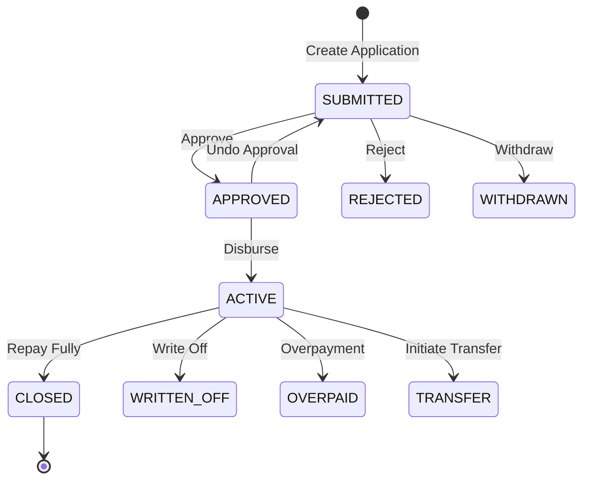

# Apache Fineract: Complete Deep Dive Guide
## A Comprehensive Course on Core Banking with Apache Fineract

**Generated:** 2025-11-17
**Target Audience:** Developers, Architects, Business Analysts learning Apache Fineract
**Scope:** Complete codebase analysis covering architecture, domain model, workflows, and integration

---

## Table of Contents

1. [Introduction to Apache Fineract](#1-introduction)
2. [Architecture Overview](#2-architecture-overview)
3. [Technology Stack](#3-technology-stack)
4. [Core Domain Model & ERD](#4-core-domain-model--erd)
5. [Loan Management - Complete Guide](#5-loan-management)
6. [Savings & Deposits Management](#6-savings--deposits-management)
7. [Client & Group Management](#7-client--group-management)
8. [Accounting & General Ledger](#8-accounting--general-ledger)
9. [Business Workflows](#9-business-workflows)
10. [API Architecture](#10-api-architecture)
11. [Multi-Tenancy](#11-multi-tenancy)
12. [Security & Authorization](#12-security--authorization)
13. [Integration Points](#13-integration-points)
14. [Deployment & Operations](#14-deployment--operations)
15. [Development Guide](#15-development-guide)

---

## 1. Introduction to Apache Fineract

### What is Apache Fineract?

Apache Fineract is an **open-source core banking platform** specifically designed for **microfinance institutions (MFIs)**, digital banks, and financial service providers. It provides comprehensive functionality for:

- Loan origination and servicing
- Savings and deposit accounts
- Client and group management
- Accounting and financial reporting
- Multi-tenant SaaS operations

### Key Characteristics

- **Production-Ready**: Used by 100+ institutions globally
- **Flexible**: Configurable products, workflows, and business rules
- **Scalable**: Multi-tenant architecture supporting millions of accounts
- **Compliant**: Built-in audit trails, maker-checker approval, regulatory reporting
- **Extensible**: Plugin architecture for custom modules

### Who Uses Fineract?

- Microfinance institutions (MFIs)
- Credit unions
- Digital banks
- Fintech companies
- Development banks
- SaaS banking providers

---

## 2. Architecture Overview

### 2.1 High-Level Architecture

```
┌─────────────────────────────────────────────────────────────┐
│                     Client Applications                      │
│  (Web UI, Mobile Apps, Third-party Systems)                 │
└─────────────────────────────────────────────────────────────┘
                              │
                              ▼
┌─────────────────────────────────────────────────────────────┐
│                    REST API Layer (JAX-RS)                   │
│  - 166 API Resources                                         │
│  - Authentication & Authorization                            │
│  - Request Validation                                        │
└─────────────────────────────────────────────────────────────┘
                              │
                              ▼
┌─────────────────────────────────────────────────────────────┐
│                  Application Service Layer                   │
│  ┌─────────────────┐      ┌─────────────────┐              │
│  │  Read Services  │      │ Write Services  │              │
│  │  (Queries)      │      │ (Commands)      │              │
│  └─────────────────┘      └─────────────────┘              │
└─────────────────────────────────────────────────────────────┘
                              │
                              ▼
┌─────────────────────────────────────────────────────────────┐
│                      Domain Layer                            │
│  - Entities (Loan, SavingsAccount, Client, etc.)           │
│  - Business Logic                                            │
│  - Domain Events                                             │
└─────────────────────────────────────────────────────────────┘
                              │
                              ▼
┌─────────────────────────────────────────────────────────────┐
│                   Infrastructure Layer                       │
│  - JPA/Hibernate (ORM)                                      │
│  - Multi-tenant Data Source Routing                         │
│  - Event Publishing                                          │
│  - Batch Processing (Spring Batch)                          │
└─────────────────────────────────────────────────────────────┘
                              │
                              ▼
┌─────────────────────────────────────────────────────────────┐
│                    Database Layer                            │
│  ┌──────────────┐  ┌──────────────┐  ┌──────────────┐     │
│  │ Tenant DB 1  │  │ Tenant DB 2  │  │ Tenant DB N  │     │
│  │ (MariaDB/    │  │ (MariaDB/    │  │ (MariaDB/    │     │
│  │  PostgreSQL) │  │  PostgreSQL) │  │  PostgreSQL) │     │
│  └──────────────┘  └──────────────┘  └──────────────┘     │
└─────────────────────────────────────────────────────────────┘
```

### 2.2 Architectural Patterns

#### CQRS (Command-Query Responsibility Segregation)

Fineract separates reads from writes:

```java
// WRITE SIDE: Commands modify state
LoanWritePlatformService.disburseLoan(loanId, command);
  → LoanDisbursementCommandHandler
    → Update Loan entity
    → Create LoanTransaction
    → Publish LoanDisbursedBusinessEvent
    → Generate Accounting Entries

// READ SIDE: Queries retrieve data
LoanReadPlatformService.retrieveLoan(loanId);
  → Direct JDBC query (optimized)
  → Return LoanData DTO
  → No business logic
```

**Benefits:**
- Optimized read queries (no ORM overhead)
- Scalable (read replicas possible)
- Audit trail (all commands logged)
- Maker-checker workflow support

#### Vertical Slice Architecture

Each domain module is self-contained:

```
fineract-loan/
├── api/              # REST endpoints
├── handler/          # Command handlers
├── service/          # Business logic
├── domain/           # Entities & repositories
├── data/             # DTOs
└── serialization/    # JSON serializers
```

**Benefits:**
- Clear functional boundaries
- Easier onboarding
- Reduced coupling
- Independent deployment (future)

#### Multi-Tenancy

Built-in from day one:

```
Request arrives with tenant identifier
  → TenantAwareBasicAuthenticationFilter
    → Extract tenant ID from header
    → Switch DataSource to tenant DB
    → Execute operation in tenant context
    → Clear context after response
```

**Isolation:**
- Separate database per tenant
- Shared schema structure
- Independent configuration
- No data leakage possible

### 2.3 Module Structure

**23 Gradle Modules:**

| Module | Purpose |
|--------|---------|
| fineract-provider | Main application JAR |
| fineract-core | Core infrastructure |
| fineract-loan | Loan management |
| fineract-savings | Savings accounts |
| fineract-accounting | GL & accounting |
| fineract-charge | Charges/fees |
| fineract-investor | Investor management |
| fineract-cob | Close of Business |
| fineract-batch-jobs | Batch processing |
| fineract-avro-schemas | Event schemas |
| fineract-integration-tests | E2E tests |
| ... and 12 more |

---

## 3. Technology Stack

### 3.1 Core Frameworks

| Technology | Version | Purpose |
|------------|---------|---------|
| Java | 21 | Programming language |
| Spring Boot | 3.5.5 | Application framework |
| Spring Security | 6.x | Authentication & authorization |
| Spring Data JPA | 3.x | Data access |
| Spring Batch | 5.x | Batch processing |
| Hibernate/EclipseLink | 6.x | ORM |
| JAX-RS/Jersey | 3.x | REST API |
| Liquibase | 4.x | Database migrations |
| Gradle | 8.x | Build system |

### 3.2 Database Support

- **Primary:** MariaDB 11.5.2+
- **Alternative:** PostgreSQL 17.0+
- **Features:** Multi-tenant, ACID compliant, replication support

### 3.3 Integration Technologies

- **Events:** Apache Avro (schema-driven serialization)
- **Messaging:** Spring Events (default), ActiveMQ/Kafka (optional)
- **Webhooks:** HTTP POST with idempotency
- **Batch:** Spring Batch with partitioning

---

## 4. Core Domain Model & ERD

### 4.1 Entity Overview

**234 JPA Entities** organized by domain:

| Domain | Entity Count | Key Entities |
|--------|--------------|--------------|
| Loan | 50+ | Loan, LoanTransaction, LoanRepaymentScheduleInstallment |
| Savings | 30+ | SavingsAccount, SavingsAccountTransaction |
| Client | 15+ | Client, ClientIdentifier, ClientAddress |
| Group | 8+ | Group, GroupLevel, GroupRole |
| Accounting | 12+ | GLAccount, JournalEntry, AccountingRule |
| Organization | 10+ | Office, Staff, Role, Permission |
| Infrastructure | 100+ | Code, CodeValue, Configuration, Calendar |

### 4.2 Core Banking Aggregate

```
                    ┌──────────┐
                    │  Office  │
                    │ (Branch) │
                    └────┬─────┘
                         │
        ┌────────────────┼────────────────┐
        │                │                │
        ▼                ▼                ▼
    ┌────────┐      ┌─────────┐      ┌──────┐
    │ Client │◄────►│  Group  │      │ Staff│
    └───┬────┘      └────┬────┘      └───┬──┘
        │                │                │
        │                │                │
        └────────┬───────┴────────────────┘
                 │
                 ▼
    ┌─────────────────────────┐
    │  Loan / SavingsAccount  │
    │  (Financial Products)   │
    └─────────────────────────┘
                 │
                 ▼
    ┌─────────────────────────┐
    │ Transactions, Charges,  │
    │ Schedules, etc.         │
    └─────────────────────────┘
```

### 4.3 Loan Aggregate (Detailed)

```
┌─────────────────────────────────────────────────────┐
│                    LOAN                              │
│  - id, account_no, external_id                      │
│  - status (PENDING/APPROVED/ACTIVE/CLOSED)          │
│  - principal_amount, interest_rate                  │
│  - term, repayment_frequency                        │
│  - principal_outstanding_derived                    │
│  - interest_outstanding_derived                     │
│  - total_outstanding_derived                        │
└──────────────┬──────────────────────────────────────┘
               │
       ┌───────┼───────┬────────┬──────────┬─────────┐
       │       │       │        │          │         │
       ▼       ▼       ▼        ▼          ▼         ▼
   ┌────┐  ┌────┐  ┌─────┐  ┌────┐  ┌───────┐  ┌───────┐
   │Prod│  │Fund│  │Clien│  │Charg│  │Transact│  │Schedul│
   │uct │  │    │  │t/Grp│  │es   │  │ions    │  │e      │
   └────┘  └────┘  └─────┘  └────┘  └───────┘  └───────┘
```

**Key Entities:**

1. **Loan** - Main loan account
2. **LoanProduct** - Product template/configuration
3. **LoanTransaction** - All monetary movements (43 types)
4. **LoanRepaymentScheduleInstallment** - Payment schedule
5. **LoanCharge** - Fees and penalties
6. **LoanCollateral** - Pledged assets
7. **Guarantor** - Loan guarantors

### 4.4 Savings Aggregate

```
┌─────────────────────────────────────────────────────┐
│              SAVINGS ACCOUNT                         │
│  - id, account_no, status                           │
│  - account_balance_derived                          │
│  - interest rate, compounding, posting              │
│  - min_balance, overdraft settings                  │
└──────────────┬──────────────────────────────────────┘
               │
       ┌───────┼───────┬────────┬──────────┐
       │       │       │        │          │
       ▼       ▼       ▼        ▼          ▼
   ┌────┐  ┌────┐  ┌─────┐  ┌────┐  ┌───────┐
   │Prod│  │Clien│  │Trans│  │Charg│  │Interest│
   │uct │  │t/Grp│  │actns│  │es   │  │Chart  │
   └────┘  └─────┘  └─────┘  └────┘  └───────┘
```

**Account Types:**
- Regular Savings
- Fixed Deposit (term-based)
- Recurring Deposit (periodic contributions)

### 4.5 Key Relationships

**Client → Accounts:**
```
Client (1) ─────────── (*) Loan
       │
       └────────────── (*) SavingsAccount
       │
       └────────────── (*) ShareAccount
```

**Group Structure:**
```
Center (GroupLevel 1)
  └── Group (GroupLevel 2)
       └── Client (member)
            └── Loan (individual or group)
```

**Accounting Flow:**
```
Loan Transaction
  └── triggers → Journal Entry
                   ├── Debit: GL Account (Asset)
                   └── Credit: GL Account (Liability/Income)
```

---

## 5. Loan Management - Complete Guide

### 5.1 Loan Entity Structure

**Main Table:** `m_loan` (150+ columns)

**Core Fields:**

```java
@Entity
@Table(name = "m_loan")
public class Loan {
    // Identification
    @Id private Long id;
    private String accountNo;              // Unique account number
    private String externalId;             // External system reference

    // Status
    private Integer loanStatusId;          // Current state
    private Integer loanSubStatusId;       // Sub-state

    // Associations
    @ManyToOne private Client client;      // Individual loans
    @ManyToOne private Group group;        // Group loans
    @ManyToOne private LoanProduct loanProduct;
    @ManyToOne private Fund fund;          // Funding source
    @ManyToOne private Staff loanOfficer;

    // Loan Terms
    private BigDecimal principal;          // Approved amount
    private BigDecimal nominalInterestRatePerPeriod;
    private Integer termFrequency;         // Loan duration
    private Integer numberOfRepayments;    // Number of installments

    // Dates
    private LocalDate submittedOnDate;
    private LocalDate approvedOnDate;
    private LocalDate disbursedOnDate;
    private LocalDate expectedMaturityDate;
    private LocalDate closedOnDate;

    // Derived Balances (calculated and cached)
    private BigDecimal principalOutstandingDerived;
    private BigDecimal interestOutstandingDerived;
    private BigDecimal feeChargesOutstandingDerived;
    private BigDecimal penaltyChargesOutstandingDerived;
    private BigDecimal totalOutstandingDerived;

    // Collections
    @OneToMany private Set<LoanTransaction> transactions;
    @OneToMany private Set<LoanRepaymentScheduleInstallment> repaymentSchedule;
    @OneToMany private Set<LoanCharge> charges;
}
```

### 5.2 Loan Lifecycle & State Machine

**10 Loan States:**

```
1. SUBMITTED_AND_PENDING_APPROVAL (100)  ← Initial state
2. APPROVED (200)                         ← Ready for disbursement
3. ACTIVE (300)                           ← Disbursed & active
4. TRANSFER_IN_PROGRESS (303)             ← Being transferred
5. TRANSFER_ON_HOLD (304)                 ← Transfer paused
6. WITHDRAWN_BY_CLIENT (400)              ← Client withdrew
7. REJECTED (500)                         ← Application rejected
8. CLOSED_OBLIGATIONS_MET (600)           ← Fully repaid
9. CLOSED_WRITTEN_OFF (601)               ← Written off
10. CLOSED_RESCHEDULE (602)               ← Rescheduled
11. OVERPAID (700)                        ← Excess payment
```

**State Transitions:**



### 5.3 Complete Loan Workflow

#### Step 1: Application Submission

```java
// API: POST /v1/loans
{
  "clientId": 123,
  "productId": 5,
  "principal": 50000.00,
  "loanTermFrequency": 36,
  "loanTermFrequencyType": 2,  // MONTHS
  "numberOfRepayments": 36,
  "repaymentEvery": 1,
  "repaymentFrequencyType": 2, // MONTHLY
  "interestRatePerPeriod": 12.0,
  "amortizationType": 1,       // EQUAL_INSTALLMENTS
  "interestType": 0,           // DECLINING_BALANCE
  "interestCalculationPeriodType": 1,
  "transactionProcessingStrategyCode": "progressive-loan-schedule-strategy",
  "loanType": "individual",
  "expectedDisbursementDate": "2024-01-15",
  "submittedOnDate": "2024-01-15"
}
```

**Processing:**
1. Validate client exists and is ACTIVE
2. Validate product exists and is active
3. Calculate loan schedule preview
4. Create Loan entity with status = SUBMITTED
5. Publish `LoanCreatedBusinessEvent`
6. Return loan ID

#### Step 2: Loan Approval (Maker-Checker)

```java
// API: POST /v1/loans/{loanId}?command=approve
{
  "approvedOnDate": "2024-01-16",
  "approvedLoanAmount": 50000.00,
  "expectedDisbursementDate": "2024-01-17",
  "note": "Approved after verification"
}
```

**Processing:**
1. Validate loan status = SUBMITTED
2. Validate approval amount <= max product amount
3. Generate final repayment schedule
4. Update loan status → APPROVED
5. Record approval date and approving user
6. Publish `LoanApprovedBusinessEvent`
7. Create accounting entries (commitment)

**Repayment Schedule Generation:**

```
Principal: 50,000
Rate: 12% annual = 1% monthly
Term: 36 months
EMI Formula: P * r * (1+r)^n / ((1+r)^n - 1)
         = 50000 * 0.01 * (1.01)^36 / ((1.01)^36 - 1)
         = 1,662.76 per month

Schedule:
Month 1: Principal 1,162.76 | Interest 500.00 | Total 1,662.76 | Balance 48,837.24
Month 2: Principal 1,174.39 | Interest 488.37 | Total 1,662.76 | Balance 47,662.85
...
Month 36: Principal 1,646.24 | Interest 16.52 | Total 1,662.76 | Balance 0.00
```

#### Step 3: Loan Disbursement

```java
// API: POST /v1/loans/{loanId}/transactions?command=disburse
{
  "actualDisbursementDate": "2024-01-17",
  "transactionAmount": 50000.00,
  "paymentTypeId": 1,  // Cash/Bank Transfer
  "note": "Disbursed to client bank account"
}
```

**Processing:**
1. Validate loan status = APPROVED
2. Create LoanTransaction (type = DISBURSEMENT)
3. Update loan status → ACTIVE
4. Update principal_disbursed_derived
5. Update expected_matured_on_date
6. Publish `LoanDisbursedBusinessEvent`
7. Create GL journal entries:
   - Debit: Cash/Bank Account
   - Credit: Loan Portfolio Account

#### Step 4: Repayment Processing

```java
// API: POST /v1/loans/{loanId}/transactions?command=repayment
{
  "transactionDate": "2024-02-17",
  "transactionAmount": 1662.76,
  "paymentTypeId": 1
}
```

**Transaction Allocation (Waterfall):**

```
Payment Amount: 1,662.76

Allocation Order (Progressive Strategy):
1. Past-due Penalty Charges → 0.00
2. Past-due Fee Charges → 0.00
3. Past-due Interest → 0.00
4. Past-due Principal → 0.00
5. Current Period Penalty → 0.00
6. Current Period Fee → 0.00
7. Current Period Interest → 500.00 (allocated)
8. Current Period Principal → 1,162.76 (allocated)
9. Future Interest → 0.00
10. Future Principal → 0.00

Remaining: 0.00 (fully allocated)
```

**Processing:**
1. Create LoanTransaction (type = REPAYMENT)
2. Apply transaction to schedule using allocation strategy
3. Update derived balances:
   - principal_outstanding_derived -= 1,162.76
   - interest_outstanding_derived -= 500.00
4. Mark installment #1 as paid/partially paid
5. Create LoanTransactionToRepaymentScheduleMapping
6. Publish `LoanRepaymentBusinessEvent`
7. Create GL entries:
   - Debit: Cash/Bank
   - Credit: Loan Portfolio (principal)
   - Credit: Interest Income (interest)

#### Step 5: Loan Closure

**Full Repayment:**
- After final installment payment
- Total outstanding = 0.00
- Status → CLOSED_OBLIGATIONS_MET
- Publish `LoanClosedBusinessEvent`
- Final GL entries

**Write-Off:**
```java
// API: POST /v1/loans/{loanId}/transactions?command=writeoff
{
  "transactionDate": "2024-06-15",
  "note": "Client defaulted, unable to recover"
}
```

**Processing:**
1. Create LoanTransaction (type = WRITEOFF)
2. Move outstanding balance to written_off_derived
3. Status → CLOSED_WRITTEN_OFF
4. GL entries:
   - Debit: Loan Loss Expense
   - Credit: Loan Portfolio

### 5.4 Loan Transaction Types (43 Types)

| Type | Purpose | Example |
|------|---------|---------|
| DISBURSEMENT | Disburse loan funds | Initial $50K disbursement |
| REPAYMENT | Record customer payment | Monthly EMI payment |
| WAIVE_INTEREST | Waive accrued interest | Hardship relief |
| WAIVE_CHARGES | Waive fees/penalties | Forgive late fee |
| WRITEOFF | Write off bad debt | Defaulted loan |
| MARKED_FOR_RESCHEDULING | Flag for restructure | Delinquent account |
| RECOVERY_REPAYMENT | Recover written-off amount | Partial recovery |
| CHARGE_PAYMENT | Pay specific charge | Pay processing fee |
| REFUND | Refund overpayment | Return excess |
| ACCRUAL | Accrue interest/fees | Daily interest accrual |
| APPROVE_TRANSFER | Approve loan transfer | Transfer to new officer |
| INITIATE_TRANSFER | Start transfer | Begin transfer workflow |
| CHARGEBACK | Reverse payment | Bounced check |
| CHARGE_OFF | Charge off loan | Mark as loss |
| DOWN_PAYMENT | Initial down payment | 20% down |
| REAGE | Re-age delinquent loan | Restart aging clock |
| REAMORTIZE | Restructure schedule | New payment plan |
| MERCHANT_ISSUED_REFUND | Merchant refund | Disputed transaction |
| PAYOUT_REFUND | Refund at closure | Overpayment refund |
| GOODWILL_CREDIT | Goodwill credit | Customer service credit |
| FORECLOSURE | Foreclosure proceeds | Collateral sale |
| CREDIT_BALANCE_REFUND | Credit balance refund | Excess payment |
| CHARGE_ADJUSTMENT | Adjust charge amount | Correct fee |
| CHARGE_OFF_FRAUD | Fraud charge-off | Fraudulent account |
| ... and 19 more |

### 5.5 Interest Calculation Methods

#### Declining Balance (Most Common)

```
Month 1: Balance 50,000 * 1% = 500 interest
Month 2: Balance 48,837.24 * 1% = 488.37 interest
Month 3: Balance 47,662.85 * 1% = 476.63 interest
...
Interest decreases each period as principal declines
```

#### Flat Interest

```
Interest = Principal * Rate * Term / 12
        = 50,000 * 0.12 * 36 / 12
        = 18,000 total interest

Per Period = 18,000 / 36 = 500 per month (constant)
```

### 5.6 Advanced Loan Features

#### Multi-Disbursement

```java
// Approve loan for $50K
// Disburse $20K on Jan 15
// Disburse $15K on Feb 15
// Disburse $15K on Mar 15

// Schedule recalculates after each disbursement
```

#### Interest Recalculation

- **Trigger:** Early/late payment
- **Effect:** Recalculate interest for remaining term
- **Options:** Reduce EMI or reduce term

#### Re-aging

```java
// Loan is 90 days overdue
// POST /v1/loans/{id}/transactions?command=reAge
// Effect: Reset aging clock, bring current
// New schedule generated with remaining balance
```

#### Re-amortization

```java
// Restructure without closing loan
// POST /v1/loans/{id}/transactions?command=reAmortize
// New terms: Extended maturity, lower payment
// Outstanding balance remains
```

#### Loan Charges

```java
// Types:
- Disbursement charges (1% of principal)
- Installment charges (fixed per period)
- Overdue charges (penalty after due date)
- Specified due date charges (one-time)
- Annual fees

// Calculation:
- FLAT: Fixed amount
- PERCENTAGE_OF_AMOUNT: % of principal
- PERCENTAGE_OF_INTEREST: % of interest
```

---

## 6. Savings & Deposits Management

### 6.1 Savings Account Types

**Three Product Types:**

1. **Regular Savings**
   - Flexible deposits/withdrawals
   - Interest calculated daily
   - Minimum balance requirements
   - Withdrawal restrictions optional

2. **Fixed Deposit**
   - Lump sum deposit
   - Fixed term (3 months, 1 year, etc.)
   - Higher interest rate
   - Pre-mature withdrawal penalties
   - Auto-renewal option

3. **Recurring Deposit**
   - Regular periodic deposits
   - Fixed term
   - Interest on accumulated deposits
   - Penalty for missed deposits

### 6.2 Savings Account Entity

```java
@Entity
@Table(name = "m_savings_account")
@Inheritance(strategy = InheritanceType.SINGLE_TABLE)
@DiscriminatorColumn(name = "deposit_type_enum")
public class SavingsAccount {
    @Id private Long id;
    private String accountNo;
    private Integer status;

    @ManyToOne private Client client;
    @ManyToOne private SavingsProduct product;

    // Interest configuration
    private BigDecimal nominalAnnualInterestRate;
    private Integer interestCompoundingPeriodType;
    private Integer interestPostingPeriodType;
    private Integer interestCalculationType;

    // Balance tracking
    private BigDecimal accountBalanceDerived;
    private BigDecimal totalDepositsderived;
    private BigDecimal totalWithdrawalsDerived;
    private BigDecimal totalInterestEarnedDerived;
    private BigDecimal totalInterestPostedDerived;

    // Constraints
    private BigDecimal minRequiredOpeningBalance;
    private BigDecimal minRequiredBalance;
    private Boolean enforceMinRequiredBalance;

    // Overdraft
    private Boolean allowOverdraft;
    private BigDecimal overdraftLimit;

    @OneToMany private Set<SavingsAccountTransaction> transactions;
    @OneToMany private Set<SavingsAccountCharge> charges;
}
```

### 6.3 Savings Lifecycle

```
1. SUBMITTED_AND_PENDING_APPROVAL
   ↓ approve
2. APPROVED
   ↓ activate (with initial deposit)
3. ACTIVE
   ├─ deposits
   ├─ withdrawals
   ├─ interest posting
   ├─ charge application
   └─ close → CLOSED
```

### 6.4 Interest Calculation

#### Daily Balance Method

```
Day 1: Balance 10,000 * (12% / 365) = 3.29
Day 2: Balance 10,000 * (12% / 365) = 3.29
Day 3: Deposit 5,000
       Balance 15,000 * (12% / 365) = 4.93
...
Month end: Sum of daily interest = 100.00
Post to account: Balance = 10,000 + 100 = 10,100
```

#### Average Daily Balance

```
Day 1-10: Balance 10,000
Day 11-20: Balance 15,000
Day 21-30: Balance 8,000

Average = (10K*10 + 15K*10 + 8K*10) / 30 = 11,000
Interest = 11,000 * 12% * (30/365) = 108.49
```

#### Interest Compounding

```
// MONTHLY compounding with QUARTERLY posting

Month 1: Principal 10,000 → Interest 100 (accrued, not posted)
Month 2: Principal 10,000 → Interest 100 (accrued, not posted)
Month 3: Principal 10,000 → Interest 100 (accrued, not posted)

Quarter End: Total accrued 300
             Post to balance: 10,000 + 300 = 10,300

Next Quarter: Interest calculated on 10,300 (compound effect)
```

### 6.5 Savings Transactions

**Transaction Types:**

| Type | Effect | Example |
|------|--------|---------|
| DEPOSIT | Increase balance | Customer deposit $500 |
| WITHDRAWAL | Decrease balance | Customer withdraw $200 |
| INTEREST_POSTING | Add earned interest | Quarterly interest $100 |
| WITHDRAWAL_FEE | Deduct fee | $5 withdrawal fee |
| ANNUAL_FEE | Deduct annual charge | $50 maintenance fee |
| OVERDRAFT_INTEREST | Charge OD interest | Interest on negative balance |
| WITHHOLD_TAX | Deduct tax on interest | 15% tax on interest |
| DIVIDEND_PAYOUT | Share dividend | Cooperative dividend |

### 6.6 Fixed Deposit Maturity

```java
// Create FD: Principal 100,000, Term 1 year, Rate 8%

// Maturity Calculation:
Maturity Amount = Principal * (1 + Rate)^Term
                = 100,000 * (1.08)^1
                = 108,000

// At Maturity Date:
1. Status → MATURED
2. Post final interest: 8,000
3. Options:
   a) Auto-renew for another term
   b) Transfer to savings account
   c) Pay out to customer
```

**Pre-mature Closure:**
```
// Close after 6 months (before 1 year maturity)
// Penalty: Reduced interest rate (e.g., 6% instead of 8%)

Interest = 100,000 * 6% * 0.5 = 3,000
Penalty = (8% - 6%) * 0.5 * 100,000 = 1,000
Net Amount = 100,000 + 3,000 - 1,000 = 102,000
```

### 6.7 Dormancy Tracking

```java
// If no transactions for 180 days:
Status remains ACTIVE
Sub-status → DORMANT

// Restrictions:
- Withdrawals may be blocked
- Dormancy fee applied monthly
- Requires reactivation (KYC update)

// After 7 years dormant (varies by jurisdiction):
Sub-status → ESCHEAT
Funds transferred to regulatory authority
```

---

## 7. Client & Group Management

### 7.1 Client Entity

```java
@Entity
@Table(name = "m_client")
public class Client {
    @Id private Long id;
    private String accountNo;
    private String externalId;
    private Integer status;  // PENDING, ACTIVE, CLOSED

    @ManyToOne private Office office;
    @ManyToOne private Staff staff;  // Assigned loan officer

    // Personal Information
    private String firstname;
    private String middlename;
    private String lastname;
    private String fullname;  // For organizations
    private String displayName;
    private LocalDate dateOfBirth;

    // Contact
    private String mobileNo;
    private String emailAddress;

    // Classification
    @ManyToOne private CodeValue gender;
    @ManyToOne private CodeValue clientType;
    @ManyToOne private CodeValue clientClassification;
    private Integer legalForm;  // PERSON or ENTITY

    // Lifecycle dates
    private LocalDate activationDate;
    private LocalDate closedOnDate;

    // Relationships
    @ManyToMany private Set<Group> groups;
    @OneToMany private Set<ClientIdentifier> identifiers;
    @OneToOne private Image image;
}
```

### 7.2 Client Types

#### Individual Client (PERSON)

```json
{
  "officeId": 1,
  "legalFormId": 1,  // PERSON
  "firstname": "John",
  "lastname": "Doe",
  "dateOfBirth": "1985-06-15",
  "genderId": 22,  // Male
  "mobileNo": "+1234567890",
  "emailAddress": "john.doe@example.com",
  "active": true,
  "activationDate": "2024-01-15"
}
```

#### Organization Client (ENTITY)

```json
{
  "officeId": 1,
  "legalFormId": 2,  // ENTITY
  "fullname": "ABC Trading Company",
  "clientNonPersonDetails": {
    "constitutionId": 25,  // Private Limited
    "mainBusinessLineId": 30,  // Retail
    "incorpNumber": "ABC123456",
    "incorpValidityTillDate": "2030-12-31"
  },
  "active": true,
  "activationDate": "2024-01-15"
}
```

### 7.3 Client Identifiers (KYC)

```java
@Entity
@Table(name = "m_client_identifier")
public class ClientIdentifier {
    @Id private Long id;
    @ManyToOne private Client client;
    @ManyToOne private CodeValue documentType;  // Passport, National ID, etc.
    private String documentKey;  // ID number
    private Integer status;  // ACTIVE, INACTIVE
    private String description;
}
```

**Example:**
```json
{
  "documentTypeId": 10,  // Passport
  "documentKey": "AB1234567",
  "status": "ACTIVE",
  "description": "Primary identification"
}
```

### 7.4 Group Structure

```
Center (GroupLevel = 1)
  ├── Group A (GroupLevel = 2)
  │   ├── Client 1
  │   ├── Client 2
  │   └── Client 3
  └── Group B (GroupLevel = 2)
      ├── Client 4
      ├── Client 5
      └── Client 6
```

**Group Lending Benefits:**
- Peer support
- Joint liability
- Reduced default risk
- Efficient loan disbursement
- Regular meeting structure

### 7.5 Client Transfer Workflow

```
Client in Office A (Mumbai Branch)
  ↓ POST /clients/{id}?command=proposeTransfer
TRANSFER_IN_PROGRESS
  ↓ Office B reviews
  ├─ Accept → Client moves to Office B
  ├─ Reject → TRANSFER_ON_HOLD
  └─ Withdraw → Back to ACTIVE in Office A
```

---

## 8. Accounting & General Ledger

### 8.1 Chart of Accounts

**5 Account Types:**

```
1. ASSET (1)
   ├── Cash and Bank Accounts
   ├── Loan Portfolio
   ├── Interest Receivable
   └── Fixed Assets

2. LIABILITY (2)
   ├── Savings Deposits
   ├── Fixed Deposits
   └── Payables

3. EQUITY (3)
   ├── Capital
   ├── Reserves
   └── Retained Earnings

4. INCOME (4)
   ├── Interest Income on Loans
   ├── Fee Income
   └── Other Income

5. EXPENSE (5)
   ├── Interest Expense on Deposits
   ├── Operating Expenses
   └── Loan Loss Provision
```

### 8.2 Journal Entry Structure

```java
@Entity
@Table(name = "acc_gl_journal_entry")
public class JournalEntry {
    @Id private Long id;
    @ManyToOne private GLAccount glAccount;
    @ManyToOne private Office office;

    private Integer type;  // DEBIT=2, CREDIT=1
    private BigDecimal amount;
    private LocalDate transactionDate;

    // Source tracking
    private Long loanTransactionId;
    private Long savingsTransactionId;
    private String transactionId;

    private Boolean reversed;
    private String description;
}
```

### 8.3 Automatic Journal Entry Generation

#### Loan Disbursement

```
Transaction: Disburse $50,000 loan

Journal Entries:
1. Debit: Loan Portfolio (Asset)        $50,000
   Credit: Fund Source (Asset/Cash)     $50,000

Description: Loan #1001 disbursement
```

#### Loan Repayment

```
Transaction: Receive $1,662.76 payment (Principal $1,162.76 + Interest $500)

Journal Entries:
1. Debit: Cash/Bank (Asset)            $1,662.76
   Credit: Loan Portfolio (Asset)       $1,162.76
   Credit: Interest Income (Revenue)    $500.00

Description: Loan #1001 repayment
```

#### Savings Deposit

```
Transaction: Customer deposits $5,000

Journal Entries:
1. Debit: Cash/Bank (Asset)            $5,000
   Credit: Savings Deposits (Liability) $5,000

Description: Savings Account #2001 deposit
```

#### Interest Posting (Savings)

```
Transaction: Post $100 interest to savings account

Journal Entries:
1. Debit: Interest Expense (Expense)    $100
   Credit: Savings Deposits (Liability)  $100

Description: Savings Account #2001 interest posting
```

### 8.4 Product-to-GL-Account Mapping

**Loan Product Mapping:**

```json
{
  "productName": "Personal Loan",
  "accountingRule": 2,  // ACCRUAL_BASED
  "accountMappings": {
    "fundSourceAccountId": 10,        // Cash/Bank
    "loanPortfolioAccountId": 20,     // Loans Outstanding
    "interestOnLoanAccountId": 50,    // Interest Income
    "incomeFromFeeAccountId": 51,     // Fee Income
    "incomeFromPenaltyAccountId": 52, // Penalty Income
    "writeOffAccountId": 70,          // Loan Loss Expense
    "transfersInSuspenseAccountId": 30, // Suspense
    "interestReceivableAccountId": 21,  // Interest Receivable (Accrual)
    "feeReceivableAccountId": 22,       // Fee Receivable (Accrual)
    "penaltyReceivableAccountId": 23    // Penalty Receivable (Accrual)
  }
}
```

**Savings Product Mapping:**

```json
{
  "productName": "Regular Savings",
  "accountingRule": 1,  // CASH_BASED
  "accountMappings": {
    "savingsReferenceAccountId": 100,  // Savings Deposit Liability
    "savingsControlAccountId": 101,    // Savings Control
    "interestOnSavingsAccountId": 60,  // Interest Expense
    "incomeFromFeeAccountId": 51,      // Fee Income
    "incomeFromPenaltyAccountId": 52,  // Penalty Income
    "overdraftPortfolioAccountId": 25, // Overdraft Asset
    "transfersInSuspenseAccountId": 30 // Suspense
  }
}
```

### 8.5 Cash vs Accrual Accounting

#### Cash-Based (Simple)

```
Recognition: When cash is received/paid

Loan Disbursement:
  DR Loan Portfolio 50,000
  CR Cash           50,000

Loan Repayment:
  DR Cash              1,662.76
  CR Loan Portfolio     1,162.76
  CR Interest Income      500.00
```

#### Accrual-Based (GAAP Compliant)

```
Recognition: When earned/incurred (regardless of cash movement)

Loan Disbursement:
  DR Loan Portfolio 50,000
  CR Cash           50,000

Daily Accrual (Day 1):
  DR Interest Receivable  16.45
  CR Interest Income      16.45

Loan Repayment (Day 30):
  DR Cash                1,662.76
  CR Interest Receivable   493.50  (reverse 30 days accrual)
  CR Interest Income         6.50  (adjustment)
  CR Loan Portfolio      1,162.76
```

### 8.6 Trial Balance & Financial Statements

**Trial Balance:**
```
GL Account Code | Account Name           | Debit      | Credit
----------------|------------------------|------------|----------
1000            | Cash and Bank          | 500,000    |
1100            | Loan Portfolio         | 5,000,000  |
1110            | Interest Receivable    | 50,000     |
2000            | Savings Deposits       |            | 3,000,000
3000            | Capital                |            | 1,000,000
4000            | Interest Income        |            | 800,000
5000            | Interest Expense       | 150,000    |
                | TOTALS                 | 5,700,000  | 4,800,000

Note: Debit must equal Credit for balanced books
```

**Balance Sheet (Statement of Financial Position):**
```
ASSETS:
  Cash and Bank              $500,000
  Loan Portfolio           $5,000,000
  Interest Receivable         $50,000
  --------------------------------
  Total Assets             $5,550,000

LIABILITIES:
  Savings Deposits         $3,000,000

EQUITY:
  Capital                  $1,000,000
  Retained Earnings        $1,550,000
  --------------------------------
  Total Liabilities & Equity $5,550,000
```

**Income Statement (P&L):**
```
REVENUE:
  Interest Income on Loans    $800,000
  Fee Income                   $50,000
  --------------------------------
  Total Revenue               $850,000

EXPENSES:
  Interest Expense on Deposits $150,000
  Operating Expenses          $200,000
  Loan Loss Provision          $50,000
  --------------------------------
  Total Expenses              $400,000

NET INCOME                    $450,000
```

---

## 9. Business Workflows

### 9.1 Maker-Checker Approval Workflow

**Purpose:** Segregation of duties for fraud prevention

```
Step 1: MAKER creates transaction
  └─ Example: Loan Officer approves $100K loan
  └─ Command stored in m_audit_log with status = PENDING
  └─ Loan NOT yet approved (command not executed)

Step 2: CHECKER reviews transaction
  └─ Senior Manager logs in
  └─ Views pending approvals queue
  └─ Reviews: Amount, client, terms, supporting docs

Step 3: CHECKER decides
  ├─ APPROVE → Command executes, loan approved, status = APPROVED
  └─ REJECT → Command discarded, loan remains pending, status = REJECTED

Audit Trail:
  - maker_id: User who created command
  - made_on_date: When command was created
  - checker_id: User who approved/rejected
  - checked_on_date: When decision was made
  - command_json: Full command payload
```

**API Workflow:**

```bash
# 1. Maker creates loan approval (returns audit ID)
POST /v1/loans/123?command=approve
→ Response: { "commandId": 456, "status": "PENDING" }

# 2. Checker lists pending commands
GET /v1/makercheckers
→ Returns all pending commands

# 3. Checker approves
POST /v1/makercheckers/456?command=approve
→ Executes loan approval, returns success

# OR Checker rejects
POST /v1/makercheckers/456?command=reject
→ Discards command, loan remains unapproved
```

### 9.2 Close of Business (COB) Process

**Runs:** Daily at configured time (e.g., 10 PM)

**Purpose:** End-of-day processing for all active loans

**Process:**

```
COB Job: LOAN_COB

Step 1: LOCK ACQUISITION
  └─ Lock all active loans (prevents concurrent updates)
  └─ Store in m_loan_accounts_lock

Step 2: ACCRUAL ACTIVITY PROCESSING
  └─ Calculate daily interest for each loan
  └─ Formula: outstanding_principal * (annual_rate / 365)
  └─ Store in accrual tables
  └─ Publish LoanAccrualActivityProcessingBusinessEvent

Step 3: INTEREST POSTING (if posting date reached)
  └─ For monthly posting on 15th: Check if today is 15th
  └─ If yes: Post accumulated interest to receivable
  └─ Journal Entry: DR Interest Receivable, CR Interest Income

Step 4: FEE/CHARGE APPLICATION
  └─ Apply scheduled charges (annual fee, service charge)
  └─ Deduct from loan balance or add to outstanding

Step 5: DELINQUENCY UPDATE
  └─ Calculate days overdue: today - due_date
  └─ Update delinquency bucket:
      - 0-30 days: Current
      - 31-60 days: Early delinquency
      - 61-90 days: Late delinquency
      - 90+ days: NPA (Non-Performing Asset)
  └─ Publish LoanDelinquencyRangeChangeBusinessEvent

Step 6: NPA CLASSIFICATION
  └─ If days_overdue > 90: Mark loan as NPA
  └─ Update m_loan_arrears_aging.npa_status = true
  └─ Trigger provisioning calculation

Step 7: LOAN LOSS PROVISIONING
  └─ Calculate required provision based on aging:
      - Current: 0% provision
      - Sub-standard: 25% provision
      - Doubtful: 50% provision
      - Loss: 100% provision
  └─ Journal Entry: DR Provision Expense, CR Loan Loss Reserve

Step 8: STATUS TRANSITIONS
  └─ Check if loan should change status:
      - Fully repaid? → CLOSED_OBLIGATIONS_MET
      - Overpaid? → OVERPAID
      - Defaulted? → Remains ACTIVE (marked NPA)

Step 9: UNLOCK
  └─ Release all loan locks
  └─ COB complete, loans available for next business day

Step 10: INCREMENT COB DATE
  └─ Job: INCREASE_COB_DATE_BY_1_DAY
  └─ COB date: 2024-01-15 → 2024-01-16
```

**Batch Job Configuration:**

Configurable steps in `m_batch_business_steps`:

| Order | Step Name | Purpose |
|-------|-----------|---------|
| 1 | LOAN_LOCK_ACQUISITION | Acquire locks |
| 2 | ACCRUAL_ACTIVITY_PROCESSING | Calculate interest |
| 3 | INTEREST_POSTING | Post to GL |
| 4 | APPLY_CHARGES | Charge fees |
| 5 | DELINQUENCY_CLASSIFICATION | Update aging |
| 6 | NPA_UPDATE | Mark NPA loans |
| 7 | LOAN_LOSS_PROVISIONING | Calculate provisions |
| 8 | CHECK_LOAN_STATUS | Status transitions |

### 9.3 Scheduled Batch Jobs

**30+ Jobs Running Automatically:**

| Job | Frequency | Purpose |
|-----|-----------|---------|
| LOAN_COB | Daily 10 PM | Loan end-of-day processing |
| POST_INTEREST_FOR_SAVINGS | Monthly | Post savings interest |
| APPLY_ANNUAL_FEE_FOR_SAVINGS | Annually | Annual maintenance fees |
| UPDATE_LOAN_ARREARS_AGEING | Daily COB | Loan aging calculation |
| APPLY_CHARGE_TO_OVERDUE_LOAN | Daily COB | Late payment penalties |
| EXECUTE_STANDING_INSTRUCTIONS | Daily | Auto-transfers |
| UPDATE_NPA | Daily COB | NPA classification |
| GENERATE_LOANLOSS_PROVISIONING | Monthly | Provisioning calculation |
| SEND_ASYNCHRONOUS_EVENTS | Every 10 sec | Webhook delivery |
| PURGE_EXTERNAL_EVENTS | Daily | Event cleanup |
| ACCOUNTING_RUNNING_BALANCE_UPDATE | Daily | GL balance update |
| UPDATE_TRIAL_BALANCE_DETAILS | Daily | Trial balance calculation |
| SEND_MESSAGES_TO_SMS_GATEWAY | Hourly | SMS sending |
| EXECUTE_EMAIL | Hourly | Email delivery |
| EXECUTE_REPORT_MAILING_JOBS | Scheduled | Automated reports |

**Job Execution API:**

```bash
# List all jobs
GET /v1/jobs

# View job details
GET /v1/jobs/{jobId}

# Manually trigger job
POST /v1/jobs/{jobId}?command=start

# View execution history
GET /v1/jobs/{jobId}/runhistory
```

### 9.4 Business Events & Webhooks

**Event Flow:**

```
1. Business Operation Occurs
   └─ Example: Loan approved

2. Business Event Published
   └─ LoanApprovedBusinessEvent created
   └─ Event data: loan ID, client ID, amount, date, etc.

3. Internal Event Listeners Execute
   └─ Post-processing tasks
   └─ Data enrichment

4. External Event Created
   └─ Event stored in m_external_event
   └─ Fields: type, category, data (Avro), status, idempotency_key

5. Event Distribution Job Runs (every 10 seconds)
   └─ Query: SELECT * FROM m_external_event WHERE status = 'TO_BE_SENT'
   └─ For each event:
       ├─ Serialize to JSON/Avro
       ├─ POST to configured webhook URL
       ├─ Include idempotency header
       ├─ Retry on failure (exponential backoff)
       └─ Mark as SENT on success

6. External System Receives Event
   └─ Process event (update CRM, send notification, etc.)
   └─ Idempotency check prevents duplicate processing
```

**Event Types:**

| Category | Event | Trigger |
|----------|-------|---------|
| Loan | LoanCreatedBusinessEvent | Loan application submitted |
| Loan | LoanApprovedBusinessEvent | Loan approved |
| Loan | LoanDisbursedBusinessEvent | Loan disbursed |
| Loan | LoanRepaymentBusinessEvent | Payment received |
| Loan | LoanClosedBusinessEvent | Loan fully repaid |
| Savings | SavingsAccountCreatedBusinessEvent | Account opened |
| Savings | SavingsAccountTransactionCreatedBusinessEvent | Deposit/withdrawal |
| Client | ClientCreatedBusinessEvent | Client registered |
| Client | ClientActivatedBusinessEvent | Client activated |

**Webhook Configuration:**

```bash
# Create webhook
POST /v1/hooks
{
  "name": "Loan Approval Webhook",
  "displayName": "Send to CRM on approval",
  "isActive": true,
  "events": [
    {
      "actionName": "APPROVE",
      "entityName": "LOAN"
    }
  ],
  "config": {
    "Content­Type": "application/json",
    "Payload­URL": "https://crm.example.com/webhooks/loan-approved"
  }
}

# Event payload sent:
{
  "type": "m.loan_approved",
  "idempotencyKey": "uuid-12345",
  "timestamp": "2024-01-15T10:30:00Z",
  "data": {
    "loanId": 123,
    "accountNo": "000000123",
    "clientId": 456,
    "approvedAmount": 50000.00,
    "approvalDate": "2024-01-15",
    "productName": "Personal Loan"
  }
}
```

---

## 10. API Architecture

### 10.1 REST API Overview

**Base URL:** `/v1/`

**166 API Resources** covering:
- Portfolio management (loans, savings, shares)
- Client/group management
- Accounting & reporting
- Administration
- Configuration

### 10.2 API Request/Response Flow

```
1. Client sends HTTP request
   └─ Headers: Authorization, X-Fineract-Entity-Id (tenant)

2. TenantAwareBasicAuthenticationFilter
   └─ Extract tenant ID from header
   └─ Load tenant configuration
   └─ Switch DataSource to tenant database

3. Authentication
   └─ Validate credentials against m_appuser
   └─ Load user roles & permissions

4. Authorization
   └─ Check if user has required permission
   └─ Apply office-level data scoping

5. API Resource (Controller)
   └─ Validate request parameters
   └─ Deserialize JSON to command object

6. Command Handler (CQRS Write Side)
   └─ Execute business logic
   └─ Update domain entities
   └─ Publish business events
   └─ Create journal entries

7. Response
   └─ Return CommandProcessingResult
   └─ Serialize to JSON
   └─ Clear tenant context
```

### 10.3 Key API Endpoints

#### Loan APIs

```bash
# Create loan application
POST /v1/loans
Body: { clientId, productId, principal, termFrequency, ... }
Response: { loanId, resourceId }

# List loans
GET /v1/loans?clientId=123&status=ACTIVE

# Loan details
GET /v1/loans/{loanId}

# Approve loan
POST /v1/loans/{loanId}?command=approve
Body: { approvedOnDate, approvedLoanAmount, ... }

# Disburse loan
POST /v1/loans/{loanId}/transactions?command=disburse
Body: { actualDisbursementDate, transactionAmount, ... }

# Record repayment
POST /v1/loans/{loanId}/transactions?command=repayment
Body: { transactionDate, transactionAmount, paymentTypeId, ... }

# Add charge
POST /v1/loans/{loanId}/charges
Body: { chargeId, amount, dueDate }

# Waive charge
POST /v1/loans/{loanId}/charges/{chargeId}?command=waive

# Write off
POST /v1/loans/{loanId}/transactions?command=writeoff

# View schedule
GET /v1/loans/{loanId}/schedule

# Transaction history
GET /v1/loans/{loanId}/transactions
```

#### Savings APIs

```bash
# Create savings account
POST /v1/savingsaccounts
Body: { clientId, productId, ... }

# Approve account
POST /v1/savingsaccounts/{accountId}?command=approve

# Activate account
POST /v1/savingsaccounts/{accountId}?command=activate
Body: { activatedOnDate }

# Deposit
POST /v1/savingsaccounts/{accountId}/transactions?command=deposit
Body: { transactionDate, transactionAmount, paymentTypeId }

# Withdrawal
POST /v1/savingsaccounts/{accountId}/transactions?command=withdrawal
Body: { transactionDate, transactionAmount }

# Close account
POST /v1/savingsaccounts/{accountId}?command=close
```

#### Client APIs

```bash
# Register client
POST /v1/clients
Body: { officeId, firstname, lastname, mobileNo, ... }

# List clients
GET /v1/clients?officeId=1&displayName=John

# Client details
GET /v1/clients/{clientId}

# Activate client
POST /v1/clients/{clientId}?command=activate
Body: { activationDate }

# Upload client photo
POST /v1/clients/{clientId}/images

# Add identifier
POST /v1/clients/{clientId}/identifiers
Body: { documentTypeId, documentKey }

# Client accounts summary
GET /v1/clients/{clientId}/accounts
```

#### Accounting APIs

```bash
# List GL accounts
GET /v1/glaccounts

# Create GL account
POST /v1/glaccounts
Body: { name, glCode, type, usage, ... }

# List journal entries
GET /v1/journalentries?officeId=1&fromDate=2024-01-01&toDate=2024-12-31

# Create manual journal entry
POST /v1/journalentries
Body: { officeId, transactionDate, debits: [...], credits: [...] }

# Trial balance
GET /v1/trialbalance?officeId=1
```

#### Report APIs

```bash
# List reports
GET /v1/reports

# Run report
GET /v1/reports/{reportName}?param1=value1&param2=value2&output=csv

# Report parameters
GET /v1/reports/{reportName}/parameters
```

### 10.4 Authentication & Security

**Basic Authentication:**

```bash
# Request
GET /v1/loans/123
Authorization: Basic base64(username:password)
X-Fineract-Entity-Id: tenant-id

# Response
200 OK
{ loanId: 123, ... }
```

**OAuth2 (Optional):**

```bash
# Get token
POST /oauth/token
grant_type=password&username=user&password=pass

# Use token
GET /v1/loans/123
Authorization: Bearer {access_token}
```

**Permission Checks:**

```java
// User must have one of these permissions:
- PORTFOLIO_LOANS_READ
- PORTFOLIO_MANAGEMENT_SUPER_USER

// Office-level scoping:
- User can only see loans in their assigned office and sub-offices
```

---

## 11. Multi-Tenancy

### 11.1 Multi-Tenant Architecture

**Two-Database Model:**

```
Master Database (fineract_default)
├── Table: fineract_tenants
│   ├── tenant_id: "abc-mfi"
│   ├── schema_name: "abc_mfi_db"
│   ├── hostname: "localhost"
│   ├── port: 3306
│   └── credentials: (encrypted)

Tenant Database 1 (abc_mfi_db)
├── All application tables (m_loan, m_client, etc.)
└── Tenant-specific data

Tenant Database 2 (xyz_bank_db)
├── All application tables (same schema)
└── Completely isolated data
```

### 11.2 Tenant Isolation

**Request Flow:**

```
HTTP Request
  → Header: X-Fineract-Entity-Id: abc-mfi
    → TenantAwareBasicAuthenticationFilter
      → ThreadLocal.set("currentTenant", "abc-mfi")
        → RoutingDataSource routes to abc_mfi_db
          → All queries execute in tenant context
            → Response sent
              → ThreadLocal.clear()
```

**Benefits:**
- Complete data isolation
- Independent schema versions (if needed)
- Separate backups & disaster recovery
- Per-tenant performance tuning
- Geographic distribution (multi-region)

### 11.3 Tenant Onboarding

```
Step 1: Create Database
  └─ CREATE DATABASE abc_mfi_db;
  └─ CREATE USER 'abc_user'@'%' IDENTIFIED BY 'password';
  └─ GRANT ALL PRIVILEGES ON abc_mfi_db.* TO 'abc_user'@'%';

Step 2: Register Tenant
  └─ INSERT INTO fineract_tenants VALUES (
      'abc-mfi', 'ABC MFI', 'localhost', 3306,
      'abc_mfi_db', 'abc_user', 'encrypted_password', ...
    );

Step 3: Run Schema Migrations
  └─ Liquibase runs on abc_mfi_db
  └─ All tables created

Step 4: Initialize Data
  └─ Create head office
  └─ Create admin user
  └─ Load default codes
  └─ Create sample chart of accounts

Step 5: Activate Tenant
  └─ Tenant ready for use
  └─ Users can login with tenant identifier
```

---

## 12. Security & Authorization

### 12.1 Role-Based Access Control (RBAC)

```
User
  └─ assigned to → Role
                     └─ has → Permissions
                                └─ control → Operations
```

**Example:**

```
User: john.doe
  └─ Role: Loan Officer
           └─ Permissions:
               - READ_LOAN
               - CREATE_LOAN
               - APPROVE_LOAN (only as MAKER)
               - READ_CLIENT
               - CREATE_CLIENT
```

### 12.2 Maker-Checker Security

```
Operation: Approve $100K Loan

Maker: Loan Officer (creates approval command)
  └─ Permission: LOAN_APPROVE_MAKER

Checker: Branch Manager (approves command)
  └─ Permission: LOAN_APPROVE_CHECKER
  └─ Cannot be same user as Maker
  └─ Must have higher authority level
```

### 12.3 Office-Level Data Scoping

```
Office Hierarchy:
Head Office (ID=1)
  ├── Branch A (ID=2)
  │   └── Sub-branch A1 (ID=4)
  └── Branch B (ID=3)

User assigned to Branch A:
  └─ Can see:
      - Clients in Branch A
      - Clients in Sub-branch A1
      - Loans in Branch A and A1
  └─ Cannot see:
      - Branch B data
      - Head Office data (unless explicitly granted)
```

---

## 13. Integration Points

### 13.1 External Integrations

| Integration | Method | Use Case |
|-------------|--------|----------|
| Accounting Systems | REST API + Journal Entries Export | Sync to ERP (SAP, Oracle) |
| Payment Gateways | Webhooks | Online loan repayments |
| SMS Gateway | API calls | OTP, notifications |
| Email | SMTP | Statements, alerts |
| Credit Bureaus | API | Credit checks, reporting |
| Mobile Apps | REST API | Customer self-service |
| Third-party Loan Origination | API | Loan application import |
| BI/Analytics | Database read-only access | Dashboards, reports |
| Core Banking | API | Integration with CBS |
| Investor Portal | API + Webhooks | Portfolio performance |

### 13.2 Event-Driven Integration

**Webhook Example:**

```bash
# External system registers webhook
POST /v1/hooks
{
  "events": [
    { "entityName": "LOAN", "actionName": "APPROVE" },
    { "entityName": "LOAN", "actionName": "DISBURSE" }
  ],
  "payloadURL": "https://partner.com/webhooks/fineract"
}

# When loan is approved, Fineract sends:
POST https://partner.com/webhooks/fineract
{
  "type": "m.loan_approved",
  "idempotencyKey": "uuid",
  "data": { loanId: 123, amount: 50000, ... }
}

# Partner system processes event (send SMS, update CRM, etc.)
```

---

## 14. Deployment & Operations

### 14.1 Deployment Options

**1. Standalone JAR (Recommended)**

```bash
java -jar fineract-provider.jar \
  --spring.profiles.active=production \
  --FINERACT_HIKARI_DRIVER_SOURCE_CLASS_NAME=org.mariadb.jdbc.Driver \
  --FINERACT_HIKARI_JDBC_URL=jdbc:mariadb://db-host:3306/fineract \
  --FINERACT_HIKARI_USERNAME=fineract \
  --FINERACT_HIKARI_PASSWORD=password
```

**2. Docker**

```bash
docker run -p 8080:8080 \
  -e FINERACT_HIKARI_JDBC_URL=jdbc:mariadb://db:3306/fineract \
  apache/fineract:latest
```

**3. Kubernetes**

```yaml
apiVersion: apps/v1
kind: Deployment
metadata:
  name: fineract
spec:
  replicas: 3
  template:
    spec:
      containers:
      - name: fineract
        image: apache/fineract:latest
        env:
        - name: FINERACT_HIKARI_JDBC_URL
          value: jdbc:mariadb://db:3306/fineract
```

### 14.2 Configuration

**Environment Variables:**

```bash
# Database
FINERACT_HIKARI_JDBC_URL=jdbc:mariadb://localhost:3306/fineract
FINERACT_HIKARI_USERNAME=fineract
FINERACT_HIKARI_PASSWORD=secret

# Tenant Database (Master)
FINERACT_TENANT_HIKARI_JDBC_URL=jdbc:mariadb://localhost:3306/fineract_tenants

# Mode
FINERACT_MODE_READ_ENABLED=true
FINERACT_MODE_WRITE_ENABLED=true
FINERACT_MODE_BATCH_ENABLED=true

# Node
FINERACT_NODE_ID=1
```

### 14.3 Monitoring

**Health Check:**

```bash
GET /actuator/health
→ { status: "UP", ... }
```

**Metrics:**

```bash
GET /actuator/metrics
GET /actuator/metrics/jvm.memory.used
GET /actuator/metrics/http.server.requests
```

### 14.4 Backup & Recovery

**Database Backup:**

```bash
# MariaDB
mysqldump -u fineract -p fineract_default > backup_$(date +%Y%m%d).sql
mysqldump -u fineract -p tenant_db_1 > backup_tenant1_$(date +%Y%m%d).sql

# Restore
mysql -u fineract -p fineract_default < backup_20240115.sql
```

**Point-in-Time Recovery:**
- Enable binary logging
- Take regular full backups
- Replay binary logs to specific timestamp

---

## 15. Development Guide

### 15.1 Development Setup

```bash
# Prerequisites
- Java 21
- Gradle 8.x
- MariaDB 11.5.2+
- IDE (IntelliJ IDEA recommended)

# Clone repository
git clone https://github.com/apache/fineract.git
cd fineract

# Build
./gradlew clean build

# Run
./gradlew bootRun

# Access
http://localhost:8080/fineract-provider/
Default credentials: mifos / password
```

### 15.2 Project Structure

```
fineract/
├── fineract-provider/          # Main application
│   └── src/main/java/org/apache/fineract/
│       ├── portfolio/          # Core banking (loans, savings, clients)
│       ├── accounting/         # GL & accounting
│       ├── infrastructure/     # Infrastructure services
│       └── commands/           # CQRS commands
├── fineract-core/              # Core domain & infrastructure
├── fineract-loan/              # Loan module
├── fineract-savings/           # Savings module
├── fineract-accounting/        # Accounting module
├── integration-tests/          # End-to-end tests
└── build.gradle                # Build configuration
```

### 15.3 Creating a New API Endpoint

**1. Create API Resource:**

```java
@Path("/v1/customendpoint")
@Component
@Scope("singleton")
@Tag(name = "Custom Endpoint")
public class CustomApiResource {

    @GET
    @Consumes(MediaType.APPLICATION_JSON)
    @Produces(MediaType.APPLICATION_JSON)
    public String retrieveData(@Context UriInfo uriInfo) {
        // Implementation
        return jsonResult;
    }

    @POST
    @Consumes(MediaType.APPLICATION_JSON)
    @Produces(MediaType.APPLICATION_JSON)
    public String createData(String jsonRequestBody) {
        // Implementation
        return jsonResult;
    }
}
```

**2. Create Command Handler:**

```java
@Service
@RequiredArgsConstructor
@CommandType(entity = "CUSTOMENTITY", action = "CREATE")
public class CreateCustomEntityCommandHandler implements NewCommandSourceHandler {

    private final CustomEntityWritePlatformService service;

    @Override
    public CommandProcessingResult processCommand(JsonCommand command) {
        return service.createEntity(command);
    }
}
```

**3. Create Service:**

```java
@Service
public class CustomEntityWritePlatformServiceImpl implements CustomEntityWritePlatformService {

    @Transactional
    @Override
    public CommandProcessingResult createEntity(JsonCommand command) {
        // 1. Validate
        // 2. Create entity
        // 3. Publish event
        // 4. Return result
    }
}
```

### 15.4 Testing

**Unit Tests:**

```java
@Test
public void testLoanCalculation() {
    LoanApplicationTerms terms = new LoanApplicationTerms(...);
    LoanScheduleGenerator generator = ...;

    LoanScheduleModel schedule = generator.generate(terms);

    assertThat(schedule.getPeriods()).hasSize(36);
    assertThat(schedule.getTotalInterest()).isEqualTo(expected);
}
```

**Integration Tests:**

```java
@Test
public void testLoanApprovalWorkflow() {
    // Create loan
    Long loanId = createLoan(...);

    // Approve loan
    approveLoan(loanId);

    // Verify status
    LoanData loan = getLoan(loanId);
    assertThat(loan.getStatus()).isEqualTo(LoanStatus.APPROVED);
}
```

---

## 16. Summary & Key Takeaways

### What You've Learned

1. **Architecture**
   - CQRS pattern separates reads from writes
   - Vertical slice architecture for domain modules
   - Multi-tenant from ground up with database-per-tenant

2. **Domain Model**
   - 234 JPA entities covering all banking operations
   - Loan aggregate with 43 transaction types
   - Savings with 3 product variants
   - Complete client/group management

3. **Workflows**
   - State machines for loan & savings lifecycles
   - Maker-checker approval for segregation of duties
   - COB process for end-of-day operations
   - 30+ batch jobs for automation

4. **Accounting**
   - Automatic journal entry generation
   - Cash vs accrual accounting
   - Product-to-GL-account mappings
   - Trial balance & financial statements

5. **Integration**
   - REST API with 166 resources
   - Event-driven webhooks
   - Avro schema for events
   - Idempotent event delivery

6. **Security**
   - RBAC with fine-grained permissions
   - Office-level data scoping
   - Audit trails for compliance
   - Multi-factor authentication support

### Apache Fineract Strengths

✅ **Production-Ready:** Battle-tested in 100+ institutions
✅ **Feature-Complete:** Loans, savings, accounting, reporting
✅ **Scalable:** Multi-tenant SaaS architecture
✅ **Compliant:** Audit trails, maker-checker, regulatory reporting
✅ **Extensible:** Plugin architecture, custom modules
✅ **Open Source:** Apache License 2.0, active community

### Next Steps

1. **Try It Out**
   - Set up local development environment
   - Create test tenant
   - Process sample loan workflow
   - Generate reports

2. **Explore Further**
   - Read source code in key modules
   - Study entity relationships
   - Understand batch job processing
   - Trace API request flow

3. **Customize**
   - Create custom reports
   - Add business-specific validations
   - Implement custom loan products
   - Integrate with external systems

4. **Contribute**
   - Join Apache Fineract community
   - Fix bugs
   - Add features
   - Improve documentation

---

## Resources

- **Official Website:** https://fineract.apache.org/
- **GitHub:** https://github.com/apache/fineract
- **Documentation:** https://cwiki.apache.org/confluence/display/FINERACT/
- **Mailing Lists:** dev@fineract.apache.org
- **Slack:** https://fineract.slack.com/

---

**End of Complete Guide**

*This guide synthesizes analysis of the Apache Fineract codebase covering 23 Gradle modules, 234 entities, 166 API endpoints, and comprehensive workflows. Use this as your reference for understanding and working with this sophisticated core banking platform.*
