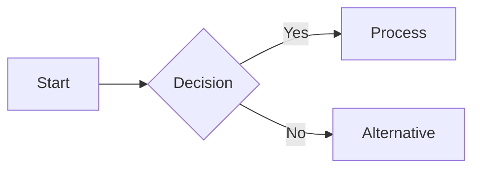
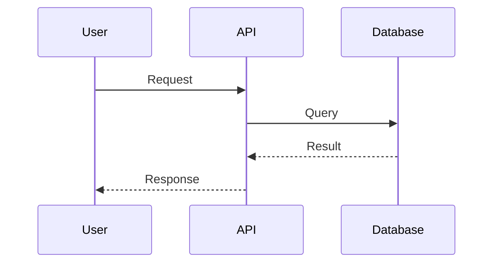
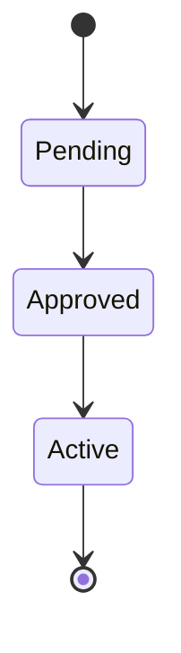
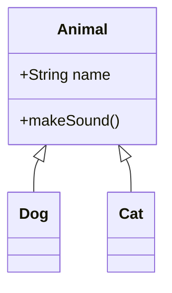
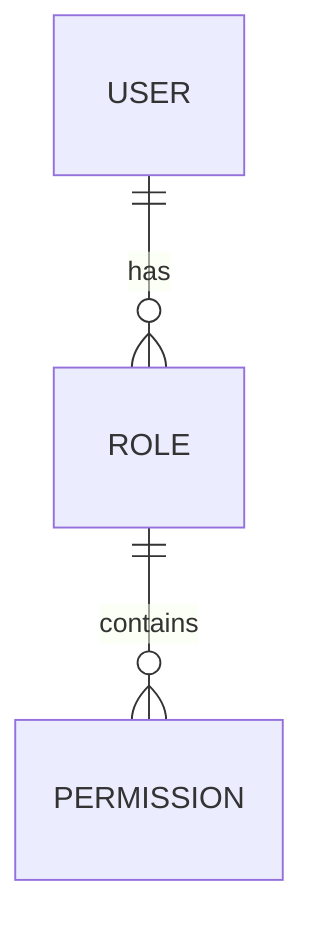

# Apache Fineract - Mermaid Workflow Diagrams

This folder contains comprehensive Mermaid workflow diagrams documenting Apache Fineract's system architecture, user flows, business processes, and integrations.

## 📋 Table of Contents

- [Overview](#overview)
- [Available Diagrams](#available-diagrams)
- [How to View Diagrams](#how-to-view-diagrams)
- [Diagram Types](#diagram-types)
- [Use Cases](#use-cases)
- [Troubleshooting](#troubleshooting)

## 🎯 Overview

These Mermaid diagrams provide visual documentation of:
- **System architecture** and component interactions
- **User workflows** from initiation to completion
- **Business processes** including state machines and sequences
- **Integration patterns** with external systems
- **Security flows** for authentication and authorization
- **Batch processing** and close of business operations

Unlike the PlantUML ERD diagrams (which focus on database schema and entity relationships), these Mermaid diagrams focus on **runtime behavior, user flows, and system interactions**.

## 📊 Available Diagrams

### 1. System Architecture (`mermaid-01-system-architecture.md`)
**What it shows:**
- Complete system architecture with all layers
- External actors (clients, loan officers, managers, admins)
- Presentation layer (Web UI, Mobile App, Third-party)
- API Gateway (REST API, Authentication, Authorization)
- Application Service layer (Read/Write services, Command Router)
- Domain layer (Loan, Savings, Client, Accounting domains)
- Infrastructure (Event Bus, Batch Jobs, Scheduler, DataSource Router)
- Data layer (Multi-tenant databases)
- External integrations (Webhooks, SMS, Email, Payment Gateway)

**Key diagrams:**
- System component graph with data flow
- Component descriptions
- Key data flows (User request, Event, Batch, Multi-tenant)

**Use when:** You need to understand how all Fineract components fit together

---

### 2. Loan Management Workflows (`mermaid-02-loan-workflow.md`)
**What it shows:**
- Complete loan lifecycle state machine (10 states)
- Loan application to disbursement sequence
- Repayment processing flow with allocation strategy
- Interest calculation methods (Declining Balance vs Flat)
- Delinquency & NPA classification
- Loan write-off workflow
- Loan closure workflow
- All 43 loan transaction types documented

**Key diagrams:**
- Loan lifecycle state diagram
- Application submission sequence
- Repayment allocation flowchart
- Interest calculation comparison
- Delinquency classification flow
- Write-off approval sequence

**Use when:** Understanding loan operations, repayment processing, or interest calculation

---

### 3. Savings Account Workflows (`mermaid-03-savings-workflow.md`)
**What it shows:**
- Savings account lifecycle (9 states)
- Account opening to activation sequence
- Daily transactions (deposit, withdrawal, holds)
- Interest calculation & posting process
- Fixed Deposit (FD) maturity workflow
- Recurring Deposit (RD) installment workflow
- Dormancy & escheat process
- Withholding tax calculation

**Key diagrams:**
- Savings lifecycle state machine
- Account opening sequence
- Deposit/withdrawal flows
- Interest calculation methods
- FD maturity workflow
- RD installment workflow
- Dormancy flow

**Use when:** Understanding savings products, interest posting, or FD/RD operations

---

### 4. Client & Group Management (`mermaid-04-client-workflow.md`)
**What it shows:**
- Client lifecycle (6 states)
- Client onboarding workflow (registration → KYC → activation)
- Group hierarchy structure (Centers → Groups → Clients)
- Group lending workflow
- Client transfer between offices
- Client charges & transactions
- Family members & additional data

**Key diagrams:**
- Client lifecycle state diagram
- KYC onboarding sequence
- Group hierarchy graph
- Group lending flow
- Client transfer sequence
- Client charge application

**Use when:** Understanding client onboarding, group lending, or KYC processes

---

### 5. Accounting & GL Integration (`mermaid-05-accounting-gl-workflow.md`)
**What it shows:**
- Automatic journal entry generation for all transaction types
- Product-to-GL-account mapping configuration
- Chart of accounts structure (5 types)
- Trial balance generation process
- GL closure & period management
- Loan loss provisioning workflow
- Financial statement generation

**Key diagrams:**
- Auto journal entry generation flowchart
- Product GL mapping sequence
- Chart of accounts hierarchy
- Trial balance generation
- GL closure workflow
- Provisioning calculation

**Use when:** Understanding accounting integration, GL posting, or financial reporting

---

### 6. COB & Batch Processing (`mermaid-06-cob-batch-workflow.md`)
**What it shows:**
- Close of Business (COB) main orchestration
- Individual loan COB processing per account
- Savings account COB processing
- Batch job scheduler architecture
- COB error handling & recovery
- Business date management
- Parallel COB processing with partitioning

**Key diagrams:**
- COB orchestration flowchart
- Per-account loan processing
- Per-account savings processing
- Batch job architecture
- Error handling sequence
- Business date state machine
- Parallel processing with partitions

**Use when:** Understanding nightly batch processing, COB operations, or scheduled jobs

---

### 7. Maker-Checker Approval Workflow (`mermaid-07-maker-checker-workflow.md`)
**What it shows:**
- Maker-Checker state machine (5 states)
- Loan approval sequence with maker-checker
- Maker-Checker configuration matrix
- Rejection workflow
- Maker withdrawal workflow
- Bulk approval workflow
- Database schema for commands
- Permission-based routing

**Key diagrams:**
- Maker-Checker state diagram
- Approval sequence
- Permission configuration matrix
- Rejection sequence
- Withdrawal flowchart
- Bulk approval sequence
- Database ERD
- Permission routing flowchart

**Use when:** Understanding approval workflows, dual control, or permission models

---

### 8. Integration & Events (`mermaid-08-integration-events-workflow.md`)
**What it shows:**
- Event Bus architecture with listeners
- Event publishing flow (sync and async)
- Event types & schema hierarchy
- Webhook configuration & delivery
- Message queue integration (Kafka)
- Payment gateway integration
- Credit bureau integration
- SMS & Email notification flow
- Event store & audit trail

**Key diagrams:**
- Event bus architecture graph
- Event publishing sequence
- Event class hierarchy
- Webhook delivery sequence
- Kafka topic architecture
- Payment gateway sequence
- Credit bureau flowchart
- Notification sequence
- Event store ERD

**Use when:** Understanding external integrations, webhooks, or event-driven architecture

---

### 9. Security & Authorization (`mermaid-09-security-auth-workflow.md`)
**What it shows:**
- Authentication flow (multi-tenant)
- Authorization flow (RBAC + data scoping)
- Role-Based Access Control (RBAC) model
- Office hierarchy & data scoping
- Permission grouping & hierarchy
- Self-service user flow (mobile/web portal)
- API key authentication (third-party)
- Two-Factor Authentication (2FA)
- Security configuration & hardening

**Key diagrams:**
- Multi-tenant authentication sequence
- Authorization flowchart
- RBAC database ERD
- Office hierarchy graph
- Permission grouping
- Self-service registration sequence
- API key authentication sequence
- 2FA flowchart
- Security configuration graph

**Use when:** Understanding authentication, authorization, RBAC, or security features

---

## 🔍 How to View Diagrams

### Method 1: GitHub (Recommended)
GitHub natively renders Mermaid diagrams in Markdown files.

1. Open any `mermaid-*.md` file on GitHub
2. Diagrams will render automatically in the preview
3. Click on individual diagrams to see larger versions

**Advantages:**
- No installation required
- Always up-to-date
- Interactive zoom

---

### Method 2: VS Code with Mermaid Extension

1. Install the "Markdown Preview Mermaid Support" extension
   ```
   ext install bierner.markdown-mermaid
   ```

2. Open any `mermaid-*.md` file

3. Press `Ctrl+Shift+V` (Windows/Linux) or `Cmd+Shift+V` (Mac) to open preview

4. Diagrams will render in the preview pane

**Advantages:**
- Works offline
- Easy to navigate between files
- Can edit and preview simultaneously

---

### Method 3: Mermaid Live Editor (Online)

1. Go to https://mermaid.live/

2. Open any `mermaid-*.md` file in a text editor

3. Copy the Mermaid code between ` ```mermaid` and ` ``` `

4. Paste into the Mermaid Live Editor

5. Diagram renders in real-time

**Advantages:**
- No installation required
- Export to PNG, SVG, PDF
- Share diagrams via URL
- Advanced editing features

**Example:**
```
https://mermaid.live/edit
```

---

### Method 4: IntelliJ IDEA / WebStorm

1. Open any `mermaid-*.md` file

2. IntelliJ will automatically detect Mermaid code blocks

3. Click the "Preview" button at the top right

4. Diagrams render in the preview pane

**Advantages:**
- Integrated with IDE
- Works offline
- Can navigate code references

---

### Method 5: Markdown Viewers

Many Markdown viewers support Mermaid:

- **Typora**: Desktop Markdown editor with native Mermaid support
- **Mark Text**: Open-source Markdown editor
- **Obsidian**: Knowledge base with Mermaid plugin
- **Notion**: Web-based note-taking with Mermaid support

---

## 📐 Diagram Types

The Mermaid diagrams use various diagram types depending on what they're showing:

### Flowchart / Graph
**Purpose:** Show processes, decision trees, and component relationships

**Used in:**
- System architecture
- Business processes
- Decision flows

**Example:**


---

### Sequence Diagram
**Purpose:** Show interactions between actors over time

**Used in:**
- User workflows
- API call sequences
- Integration flows

**Example:**


---

### State Diagram
**Purpose:** Show entity lifecycle and state transitions

**Used in:**
- Loan lifecycle
- Savings lifecycle
- Client lifecycle
- Business date management

**Example:**


---

### Class Diagram
**Purpose:** Show entity relationships and hierarchies

**Used in:**
- Event type hierarchy
- Domain models

**Example:**


---

### Entity Relationship Diagram
**Purpose:** Show database schema relationships

**Used in:**
- Maker-Checker command storage
- Event store schema
- RBAC model

**Example:**


---

## 💡 Use Cases

### For New Developers
**Start with:**
1. `mermaid-01-system-architecture.md` - Understand overall structure
2. `mermaid-09-security-auth-workflow.md` - Understand authentication
3. `mermaid-02-loan-workflow.md` - Understand core business logic

### For Business Analysts
**Focus on:**
1. `mermaid-02-loan-workflow.md` - Loan operations
2. `mermaid-03-savings-workflow.md` - Savings operations
3. `mermaid-04-client-workflow.md` - Customer management
4. `mermaid-07-maker-checker-workflow.md` - Approval processes

### For Integration Developers
**Study:**
1. `mermaid-08-integration-events-workflow.md` - External integrations
2. `mermaid-01-system-architecture.md` - API architecture
3. `mermaid-09-security-auth-workflow.md` - API authentication

### For DevOps / Infrastructure
**Review:**
1. `mermaid-06-cob-batch-workflow.md` - Batch processing
2. `mermaid-01-system-architecture.md` - Infrastructure components
3. `mermaid-09-security-auth-workflow.md` - Security hardening

### For Accountants / Finance Team
**Examine:**
1. `mermaid-05-accounting-gl-workflow.md` - GL integration
2. `mermaid-02-loan-workflow.md` - Loan accounting
3. `mermaid-03-savings-workflow.md` - Interest calculation

### For QA / Testers
**Test scenarios from:**
1. All workflow diagrams for happy path testing
2. State diagrams for state transition testing
3. Error handling sequences for negative testing

---

## 🔧 Troubleshooting

### Diagrams Not Rendering in GitHub
- **Issue:** Mermaid code shows as plain text
- **Solution:** Ensure file extension is `.md` and code block starts with ` ```mermaid`
- **Check:** GitHub sometimes has rendering delays, refresh the page

### Diagrams Not Rendering in VS Code
- **Issue:** Preview shows code instead of diagram
- **Solution:** Install "Markdown Preview Mermaid Support" extension
- **Alternative:** Use "Mermaid Editor" extension for dedicated preview

### Syntax Errors in Mermaid Live Editor
- **Issue:** "Syntax Error" message when pasting code
- **Solution:** Ensure you copied only the content between ` ```mermaid` tags (exclude the backticks)
- **Check:** Look for special characters that might have been corrupted during copy

### Diagrams Too Large to View
- **Issue:** Complex diagrams are hard to read
- **Solution:** Use Mermaid Live Editor and export as SVG for infinite zoom
- **Alternative:** Export as PNG at high resolution (2x or 4x)

### Want to Edit Diagrams
- **Issue:** Need to modify diagrams for presentation
- **Solution:** Copy Mermaid code to Mermaid Live Editor
- **Edit:** Make changes in editor
- **Export:** Download as PNG, SVG, or PDF

### Want to Print Diagrams
- **Issue:** Need hard copies for documentation
- **Solution:** Export as PDF from Mermaid Live Editor
- **Alternative:** Use browser print function from GitHub preview

---

## 📚 Additional Resources

### Mermaid Documentation
- Official docs: https://mermaid.js.org/
- Syntax reference: https://mermaid.js.org/intro/syntax-reference.html
- Live editor: https://mermaid.live/

### Apache Fineract Resources
- Main documentation: https://fineract.apache.org/
- API docs: https://demo.fineract.dev/fineract-provider/api-docs/apiLive.htm
- GitHub repo: https://github.com/apache/fineract

### Related Diagrams in This Folder
- **PlantUML ERD Diagrams**: See `ERD_DIAGRAMS_README.md` for database schema diagrams
- **Complete Guide**: See `APACHE_FINERACT_COMPLETE_GUIDE.md` for comprehensive text documentation

---

## 🎓 Learning Path

### Beginner (Week 1)
1. Read system architecture diagram
2. Understand authentication flow
3. Study loan lifecycle states
4. Review client onboarding

### Intermediate (Week 2-3)
1. Deep dive into loan workflows
2. Study accounting integration
3. Understand maker-checker pattern
4. Explore batch processing

### Advanced (Week 4+)
1. Master integration patterns
2. Study event-driven architecture
3. Understand multi-tenancy
4. Review security hardening

---

## 📝 Notes

- **Complementary to PlantUML ERDs**: These workflow diagrams show *how* data flows and *what* happens at runtime, while PlantUML ERDs show *what* data is stored and *how* it's related
- **Real-world scenarios**: Each diagram includes concrete examples from production systems
- **Version compatibility**: Diagrams reflect Apache Fineract 1.x architecture as of 2025
- **Updates**: Diagrams are living documentation and may be updated as the system evolves

---

## 🤝 Contributing

If you find errors or want to suggest improvements:
1. Open an issue on GitHub
2. Submit a pull request with corrections
3. Tag the maintainers for review

---

## 📄 License

These diagrams are part of the Apache Fineract project documentation and follow the same Apache 2.0 license.

---

**Last Updated:** 2025-11-18
**Apache Fineract Version:** 1.x
**Documentation Version:** 1.0
