# Apache Fineract - System Architecture Overview

```mermaid
graph TB
    subgraph "External Actors"
        Client[Client/Customer]
        LoanOfficer[Loan Officer]
        BranchManager[Branch Manager]
        Accountant[Accountant]
        Admin[System Admin]
        ExternalSystem[External Systems]
    end

    subgraph "Presentation Layer"
        WebUI[Web Application]
        MobileApp[Mobile App]
        ThirdParty[Third-party Integration]
    end

    subgraph "API Gateway Layer"
        RestAPI[REST API Layer<br/>JAX-RS / Spring MVC]
        AuthFilter[Authentication Filter<br/>Tenant-Aware]
        AuthzFilter[Authorization Filter<br/>RBAC]
    end

    subgraph "Application Service Layer"
        ReadServices[Read Services<br/>Query Optimization]
        WriteServices[Write Services<br/>Command Handlers]
        CommandRouter[Command Router<br/>Maker-Checker]
    end

    subgraph "Domain Layer"
        LoanDomain[Loan Domain<br/>Business Logic]
        SavingsDomain[Savings Domain<br/>Interest Calc]
        ClientDomain[Client Domain<br/>KYC Management]
        AccountingDomain[Accounting Domain<br/>GL Posting]
    end

    subgraph "Infrastructure Layer"
        EventBus[Event Bus<br/>Business Events]
        BatchJobs[Batch Jobs<br/>COB Processing]
        Scheduler[Job Scheduler<br/>Quartz/Spring]
        DataSource[Multi-Tenant<br/>DataSource Router]
    end

    subgraph "Data Layer"
        TenantDB1[(Tenant DB 1<br/>MariaDB)]
        TenantDB2[(Tenant DB 2<br/>MariaDB)]
        TenantDBN[(Tenant DB N<br/>MariaDB)]
        MasterDB[(Master DB<br/>Tenant Registry)]
    end

    subgraph "External Integration"
        Webhooks[Webhooks<br/>HTTP POST]
        MessageQueue[Message Queue<br/>Kafka/ActiveMQ]
        SMS[SMS Gateway]
        Email[Email Service]
        PaymentGW[Payment Gateway]
        CreditBureau[Credit Bureau]
    end

    %% User to UI connections
    Client --> WebUI
    Client --> MobileApp
    LoanOfficer --> WebUI
    BranchManager --> WebUI
    Accountant --> WebUI
    Admin --> WebUI
    ExternalSystem --> ThirdParty

    %% UI to API connections
    WebUI --> RestAPI
    MobileApp --> RestAPI
    ThirdParty --> RestAPI

    %% API Layer flow
    RestAPI --> AuthFilter
    AuthFilter --> AuthzFilter
    AuthzFilter --> ReadServices
    AuthzFilter --> WriteServices
    WriteServices --> CommandRouter

    %% Service to Domain
    ReadServices --> LoanDomain
    ReadServices --> SavingsDomain
    ReadServices --> ClientDomain
    ReadServices --> AccountingDomain

    WriteServices --> LoanDomain
    WriteServices --> SavingsDomain
    WriteServices --> ClientDomain
    WriteServices --> AccountingDomain

    %% Domain to Infrastructure
    LoanDomain --> EventBus
    SavingsDomain --> EventBus
    ClientDomain --> EventBus
    AccountingDomain --> EventBus

    LoanDomain --> DataSource
    SavingsDomain --> DataSource
    ClientDomain --> DataSource
    AccountingDomain --> DataSource

    %% Infrastructure connections
    EventBus --> Webhooks
    EventBus --> MessageQueue
    BatchJobs --> DataSource
    Scheduler --> BatchJobs
    DataSource --> TenantDB1
    DataSource --> TenantDB2
    DataSource --> TenantDBN
    AuthFilter --> MasterDB

    %% External integrations
    EventBus --> SMS
    EventBus --> Email
    WriteServices --> PaymentGW
    ReadServices --> CreditBureau

    %% Styling
    classDef actor fill:#e1f5ff,stroke:#01579b,stroke-width:2px
    classDef ui fill:#fff3e0,stroke:#e65100,stroke-width:2px
    classDef api fill:#f3e5f5,stroke:#4a148c,stroke-width:2px
    classDef service fill:#e8f5e9,stroke:#1b5e20,stroke-width:2px
    classDef domain fill:#fff9c4,stroke:#f57f17,stroke-width:2px
    classDef infra fill:#fce4ec,stroke:#880e4f,stroke-width:2px
    classDef data fill:#e0f2f1,stroke:#004d40,stroke-width:2px
    classDef external fill:#efebe9,stroke:#3e2723,stroke-width:2px

    class Client,LoanOfficer,BranchManager,Accountant,Admin,ExternalSystem actor
    class WebUI,MobileApp,ThirdParty ui
    class RestAPI,AuthFilter,AuthzFilter api
    class ReadServices,WriteServices,CommandRouter service
    class LoanDomain,SavingsDomain,ClientDomain,AccountingDomain domain
    class EventBus,BatchJobs,Scheduler,DataSource infra
    class TenantDB1,TenantDB2,TenantDBN,MasterDB data
    class Webhooks,MessageQueue,SMS,Email,PaymentGW,CreditBureau external
```



## System Components Description

### External Actors
- **Client/Customer**: End users accessing accounts, making transactions
- **Loan Officer**: Creates loan applications, manages client relationships
- **Branch Manager**: Approves loans, manages operations
- **Accountant**: Manages GL accounts, financial reporting
- **System Admin**: Configures system, manages users and permissions
- **External Systems**: Third-party integrations (payment gateways, credit bureaus)

### Presentation Layer
- **Web Application**: Browser-based UI for staff and management
- **Mobile App**: Customer-facing mobile application
- **Third-party Integration**: External system API access

### API Gateway Layer
- **REST API**: JAX-RS endpoints handling HTTP requests
- **Authentication Filter**: Validates credentials, extracts tenant context
- **Authorization Filter**: RBAC permission checking, office-level data scoping

### Application Service Layer
- **Read Services**: Optimized queries using JDBC, returns DTOs
- **Write Services**: Business logic execution, command handling
- **Command Router**: Maker-checker approval workflow orchestration

### Domain Layer
- **Loan Domain**: Loan lifecycle, repayment processing, interest calculation
- **Savings Domain**: Account management, interest posting, transactions
- **Client Domain**: KYC management, group structures, client lifecycle
- **Accounting Domain**: GL accounts, journal entries, automatic posting

### Infrastructure Layer
- **Event Bus**: Publishes business events for internal/external consumption
- **Batch Jobs**: Scheduled tasks (COB, interest posting, aging)
- **Job Scheduler**: Quartz/Spring scheduler managing job execution
- **DataSource Router**: Multi-tenant database routing based on tenant context

### Data Layer
- **Tenant Databases**: Separate database per tenant for data isolation
- **Master Database**: Tenant registry, global configuration

### External Integration
- **Webhooks**: HTTP POST notifications to external systems
- **Message Queue**: Kafka/ActiveMQ for async event processing
- **SMS Gateway**: Customer notifications via SMS
- **Email Service**: Email notifications and reports
- **Payment Gateway**: Online payment processing
- **Credit Bureau**: Credit score checks, default reporting

## Key Data Flows

1. **User Request Flow**:
   ```
   User → UI → REST API → Auth → Authorization → Service → Domain → Database
   ```

2. **Event Flow**:
   ```
   Domain Action → Event Bus → [Webhooks, Queue, SMS, Email]
   ```

3. **Batch Processing Flow**:
   ```
   Scheduler → Batch Job → Domain Logic → Database → Event Bus
   ```

4. **Multi-Tenant Flow**:
   ```
   Request → Extract Tenant ID → Route to Tenant DB → Execute → Return
   ```
