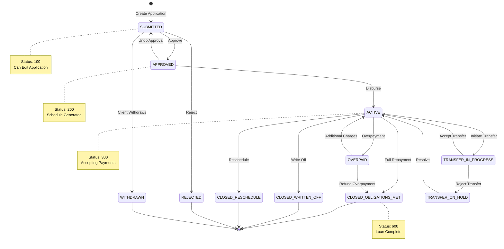
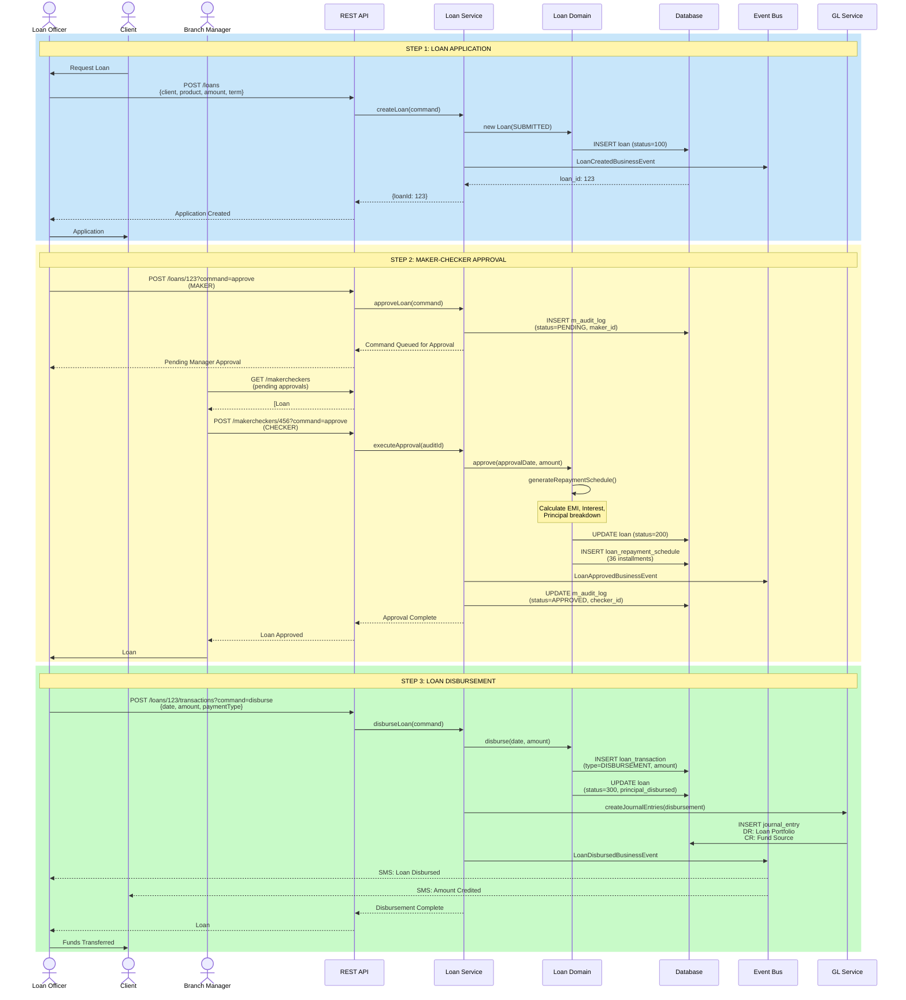
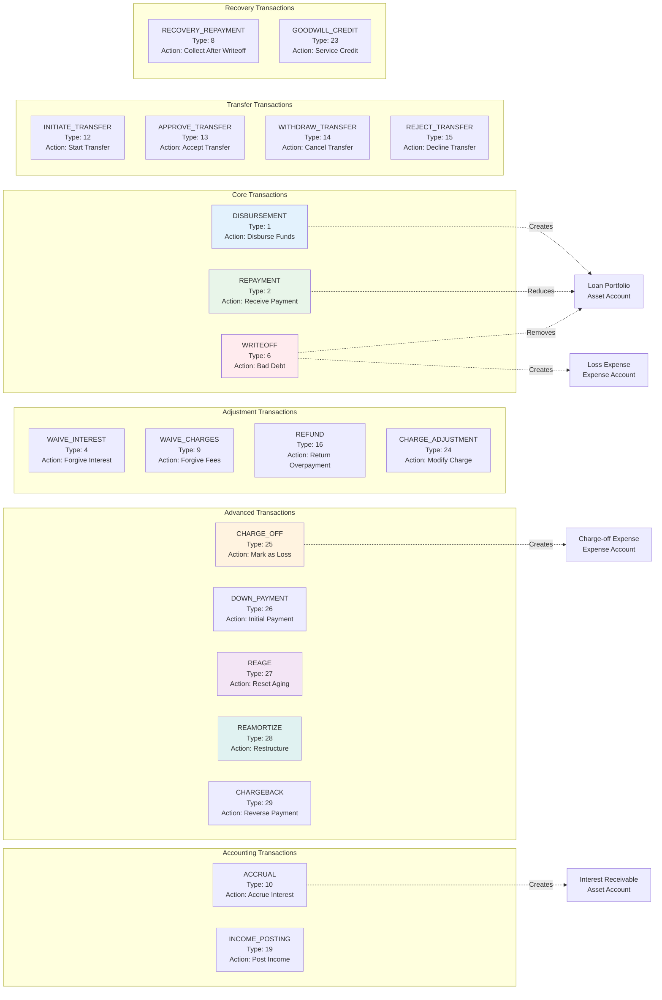
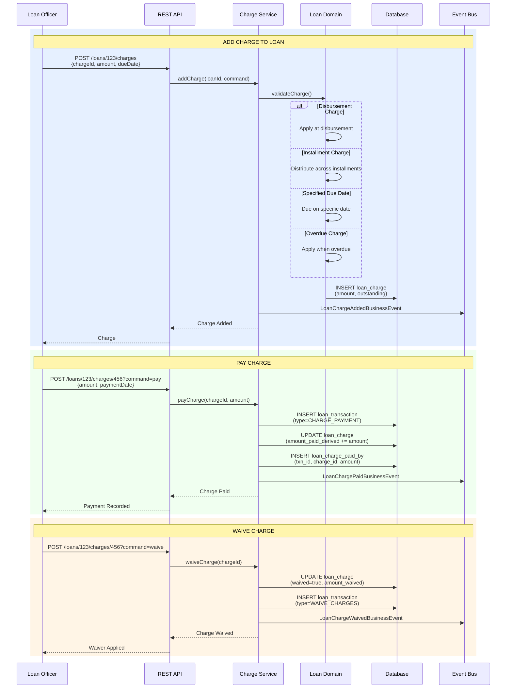
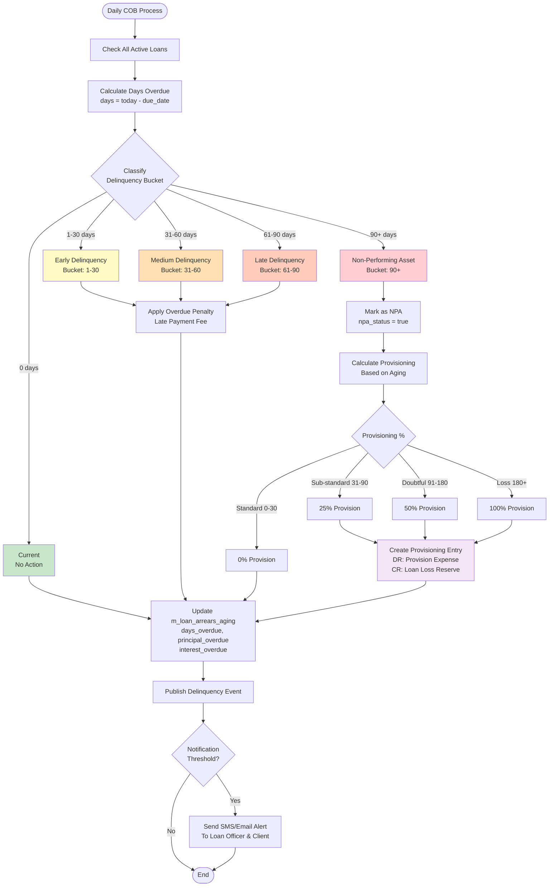

# Loan Management - Complete Workflow

## 1. Loan Lifecycle State Diagram



## 2. Loan Application to Disbursement Sequence



## 3. Loan Repayment Processing Flow

```mermaid
flowchart TD
    Start([Customer Makes Payment]) --> Receive[Receive Payment<br/>Amount: $1,662.76]
    Receive --> CreateTxn[Create LoanTransaction<br/>type: REPAYMENT]

    CreateTxn --> LoadSchedule[Load Repayment Schedule<br/>Get Overdue & Current Installments]

    LoadSchedule --> SelectStrategy{Select Allocation<br/>Strategy}

    SelectStrategy -->|Progressive| Progressive[Progressive Strategy<br/>Past → Current → Future]
    SelectStrategy -->|Penalties First| PenaltyFirst[Penalty First Strategy]
    SelectStrategy -->|Principal First| PrincipalFirst[Principal Priority]

    Progressive --> AllocateOrder[Allocation Order:<br/>1. Past Due Penalties<br/>2. Past Due Fees<br/>3. Past Due Interest<br/>4. Past Due Principal<br/>5. Current Penalty<br/>6. Current Fee<br/>7. Current Interest<br/>8. Current Principal]

    AllocateOrder --> AllocatePenalty{Penalties Due?}
    AllocatePenalty -->|Yes| PayPenalty[Allocate to Penalties<br/>Update penalty_paid_derived]
    AllocatePenalty -->|No| AllocateFee{Fees Due?}
    PayPenalty --> AllocateFee

    AllocateFee -->|Yes| PayFee[Allocate to Fees<br/>Update fee_paid_derived]
    AllocateFee -->|No| AllocateInterest{Interest Due?}
    PayFee --> AllocateInterest

    AllocateInterest -->|Yes| PayInterest[Allocate to Interest<br/>Amount: $500<br/>Update interest_paid_derived]
    AllocateInterest -->|No| AllocatePrincipal{Principal Due?}
    PayInterest --> AllocatePrincipal

    AllocatePrincipal -->|Yes| PayPrincipal[Allocate to Principal<br/>Amount: $1,162.76<br/>Update principal_paid_derived]
    AllocatePrincipal -->|No| CheckRemaining
    PayPrincipal --> CheckRemaining{Amount Remaining?}

    CheckRemaining -->|Yes| Overpayment[Record Overpayment<br/>Update overpayment_derived<br/>Status → OVERPAID]
    CheckRemaining -->|No| UpdateInstallment[Update Installment<br/>Mark as Paid/Partial]

    Overpayment --> UpdateDerived
    UpdateInstallment --> UpdateDerived[Update Loan Derived Balances<br/>principal_outstanding -= paid<br/>interest_outstanding -= paid<br/>total_outstanding -= paid]

    UpdateDerived --> CreateJE[Create Journal Entries<br/>DR: Cash/Bank $1,662.76<br/>CR: Loan Portfolio $1,162.76<br/>CR: Interest Income $500.00]

    CreateJE --> CheckStatus{Loan Fully Paid?}

    CheckStatus -->|Yes| CloseLoan[Update Status<br/>ACTIVE → CLOSED_OBLIGATIONS_MET<br/>Set closedon_date]
    CheckStatus -->|No| StayActive[Status Remains ACTIVE<br/>Update next_payment_date]

    CloseLoan --> PublishEvent[Publish LoanClosedBusinessEvent]
    StayActive --> PublishEvent2[Publish LoanRepaymentBusinessEvent]

    PublishEvent --> NotifyCustomer[Send SMS/Email<br/>Loan Closed Successfully]
    PublishEvent2 --> NotifyCustomer2[Send SMS<br/>Payment Received<br/>Balance: $XX,XXX]

    NotifyCustomer --> End([End])
    NotifyCustomer2 --> End

    style Start fill:#e1f5ff
    style End fill:#c8e6c9
    style CloseLoan fill:#fff9c4
    style Overpayment fill:#ffe0b2
    style CreateJE fill:#f3e5f5
```



## 4. Loan Transaction Types & Actions



## 5. Interest Calculation Methods

```mermaid
graph TB
    subgraph "Declining Balance Method"
        DB_Start[Principal: $50,000<br/>Rate: 12% annual = 1% monthly]
        DB_Start --> DB_M1[Month 1:<br/>Balance: $50,000<br/>Interest: $50,000 × 1% = $500<br/>Principal: $1,162.76<br/>Payment: $1,662.76]
        DB_M1 --> DB_M2[Month 2:<br/>Balance: $48,837.24<br/>Interest: $48,837.24 × 1% = $488.37<br/>Principal: $1,174.39<br/>Payment: $1,662.76]
        DB_M2 --> DB_M3[Month 3:<br/>Balance: $47,662.85<br/>Interest: $47,662.85 × 1% = $476.63<br/>Principal: $1,186.13<br/>Payment: $1,662.76]
        DB_M3 --> DB_Note[Interest DECREASES<br/>Principal INCREASES<br/>Payment CONSTANT]
    end

    subgraph "Flat Interest Method"
        Flat_Start[Principal: $50,000<br/>Rate: 12% annual<br/>Term: 36 months]
        Flat_Start --> Flat_Calc[Total Interest:<br/>$50,000 × 12% × 3 years = $18,000]
        Flat_Calc --> Flat_Monthly[Per Month:<br/>Interest: $18,000 ÷ 36 = $500<br/>Principal: $50,000 ÷ 36 = $1,388.89<br/>Payment: $1,888.89]
        Flat_Monthly --> Flat_Note[Interest CONSTANT<br/>Principal CONSTANT<br/>Payment CONSTANT]
    end

    subgraph "Compound Interest Formula"
        Formula[EMI = P × r × (1+r)^n / ((1+r)^n - 1)]
        Formula --> Variables[P = Principal Amount<br/>r = Monthly Interest Rate<br/>n = Number of Months]
        Variables --> Example[Example:<br/>P = $50,000<br/>r = 0.01 monthly<br/>n = 36 months<br/>EMI = $1,662.76]
    end

    style DB_Note fill:#e8f5e9
    style Flat_Note fill:#fff3e0
    style Example fill:#e1f5ff
```

## 6. Loan Charge Management



## 7. Loan Delinquency & NPA Classification



## Transaction Type Summary

| Type | Code | Purpose | GL Impact |
|------|------|---------|-----------|
| DISBURSEMENT | 1 | Disburse loan funds | DR: Loan Portfolio, CR: Cash |
| REPAYMENT | 2 | Customer payment | DR: Cash, CR: Loan Portfolio/Interest |
| WAIVE_INTEREST | 4 | Forgive interest | DR: Interest Waived, CR: Interest Receivable |
| WRITEOFF | 6 | Bad debt write-off | DR: Loss Expense, CR: Loan Portfolio |
| WAIVE_CHARGES | 9 | Forgive fees | DR: Fee Waived, CR: Fee Receivable |
| ACCRUAL | 10 | Accrue interest | DR: Interest Receivable, CR: Interest Income |
| CHARGE_PAYMENT | 17 | Pay specific charge | DR: Cash, CR: Fee Income |
| CHARGE_OFF | 25 | Mark as charge-off | DR: Charge-off Expense, CR: Loan Portfolio |
| REAGE | 27 | Reset aging clock | Modify schedule, reset aging |
| REAMORTIZE | 28 | Restructure payments | Recalculate schedule |
| CHARGEBACK | 29 | Reverse payment | Reverse original GL entries |
