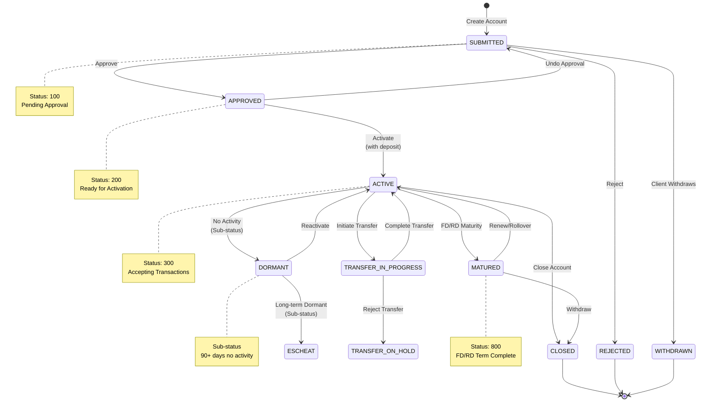
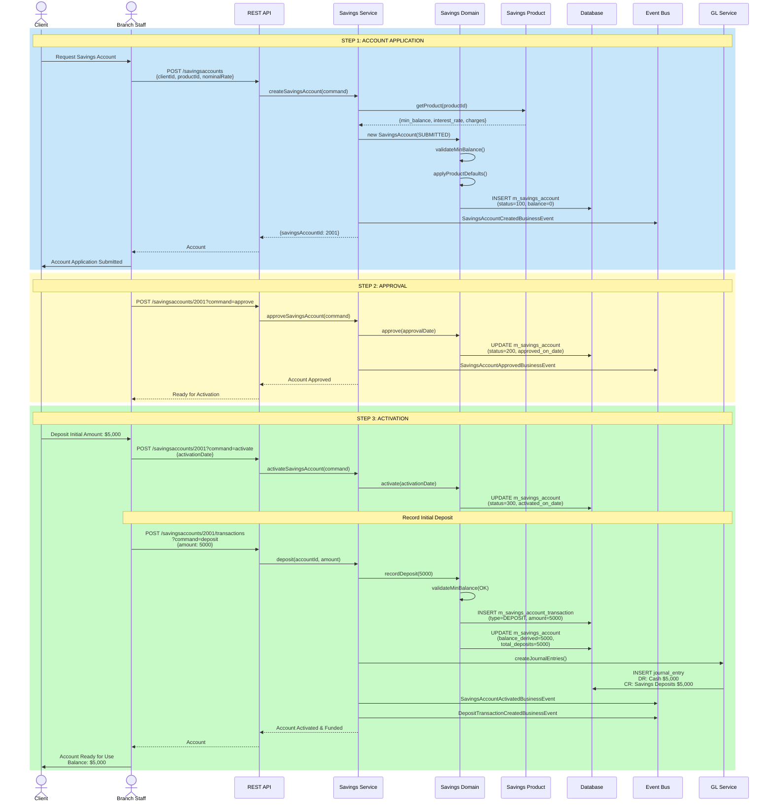
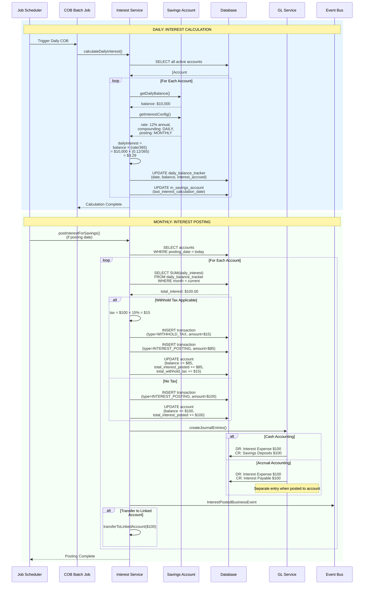
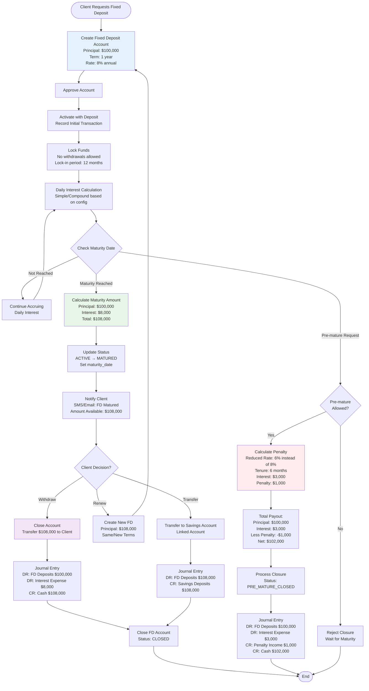
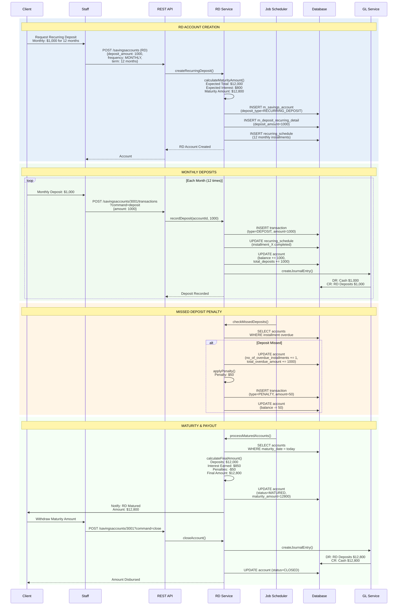
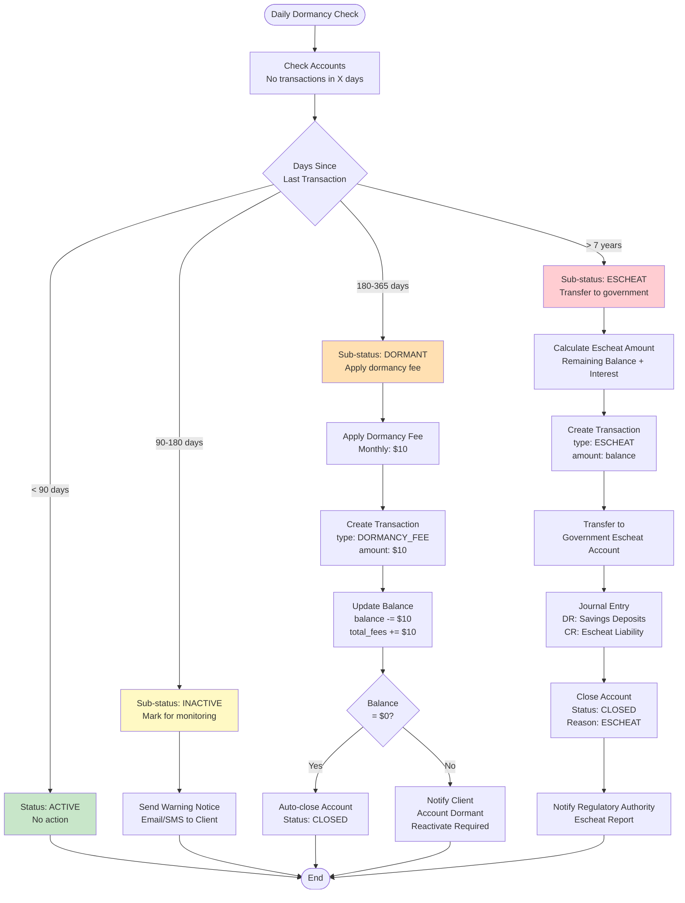

# Savings Account Management - Complete Workflow

## 1. Savings Account Lifecycle State Diagram



## 2. Savings Account Opening to Activation



## 3. Daily Savings Transactions Flow

```mermaid
flowchart TD
    Start([Customer Initiates Transaction]) --> TxnType{Transaction Type?}

    %% Deposit Flow
    TxnType -->|Deposit| ValidateDeposit[Validate Deposit<br/>Check account active<br/>Check amount > 0]
    ValidateDeposit --> RecordDeposit[Create Transaction<br/>type: DEPOSIT<br/>amount: $500]
    RecordDeposit --> UpdateBalDeposit[Update Balance<br/>balance += $500<br/>total_deposits += $500]
    UpdateBalDeposit --> CheckInterest[Check if Interest<br/>Calculation Date]
    CheckInterest -->|Yes| CalcInterest[Calculate Interest<br/>Since Last Calculation]
    CheckInterest -->|No| GLDeposit
    CalcInterest --> GLDeposit[Journal Entry<br/>DR: Cash $500<br/>CR: Savings Deposits $500]
    GLDeposit --> NotifyDeposit[Send SMS:<br/>Deposited $500<br/>Balance: $X,XXX]
    NotifyDeposit --> EndDeposit([End])

    %% Withdrawal Flow
    TxnType -->|Withdrawal| ValidateWithdrawal[Validate Withdrawal<br/>Check balance sufficient<br/>Check min_balance<br/>Check lock-in period]

    ValidateWithdrawal -->|Valid| CheckWithdrawalFee{Withdrawal<br/>Fee Applicable?}
    ValidateWithdrawal -->|Invalid| RejectTxn[Reject Transaction<br/>Insufficient Balance]
    RejectTxn --> EndReject([End - Rejected])

    CheckWithdrawalFee -->|Yes| ApplyFee[Apply Withdrawal Fee<br/>Create WITHDRAWAL_FEE txn]
    CheckWithdrawalFee -->|No| RecordWithdrawal

    ApplyFee --> RecordWithdrawal[Create Transaction<br/>type: WITHDRAWAL<br/>amount: $200]
    RecordWithdrawal --> UpdateBalWithdraw[Update Balance<br/>balance -= $200<br/>total_withdrawals += $200]

    UpdateBalWithdraw --> CheckOverdraft{Overdraft<br/>Allowed?}
    CheckOverdraft -->|Yes & Negative| CalcODInterest[Calculate Overdraft<br/>Interest Charge]
    CheckOverdraft -->|No/Positive| GLWithdrawal

    CalcODInterest --> GLWithdrawal[Journal Entry<br/>DR: Savings Deposits $200<br/>CR: Cash $200]
    GLWithdrawal --> NotifyWithdrawal[Send SMS:<br/>Withdrawn $200<br/>Balance: $X,XXX]
    NotifyWithdrawal --> EndWithdrawal([End])

    %% Hold Amount
    TxnType -->|Hold Amount| ValidateHold[Validate Hold<br/>Check balance >= hold]
    ValidateHold --> RecordHold[Create Transaction<br/>type: AMOUNT_HOLD<br/>frozen_amount: $1,000]
    RecordHold --> UpdateHold[Update<br/>on_hold_funds += $1,000<br/>available_balance -= $1,000]
    UpdateHold --> NotifyHold[Notify: $1,000 On Hold]
    NotifyHold --> EndHold([End])

    %% Release Hold
    TxnType -->|Release Hold| FindHold[Find Hold Transaction]
    FindHold --> RecordRelease[Create Transaction<br/>type: AMOUNT_RELEASE<br/>release_id: hold_txn_id]
    RecordRelease --> UpdateRelease[Update<br/>on_hold_funds -= $1,000<br/>available_balance += $1,000]
    UpdateRelease --> NotifyRelease[Notify: Hold Released]
    NotifyRelease --> EndRelease([End])

    style ValidateDeposit fill:#e8f5e9
    style RecordWithdrawal fill:#fff3e0
    style RejectTxn fill:#ffcdd2
    style CalcInterest fill:#e1f5ff
    style GLDeposit fill:#f3e5f5
```



## 4. Interest Calculation & Posting Process



## 5. Interest Calculation Methods Comparison

```mermaid
graph TB
    subgraph "Daily Balance Method"
        DB_Account[Account: #2001<br/>Rate: 12% annual<br/>Posting: Monthly]

        DB_Account --> DB_Day1[Day 1: Balance $10,000<br/>Interest: $10,000 × 0.12/365 = $3.29]
        DB_Day1 --> DB_Day2[Day 2: Balance $10,000<br/>Interest: $10,000 × 0.12/365 = $3.29]
        DB_Day2 --> DB_Day3[Day 3: Deposit $5,000<br/>Balance: $15,000<br/>Interest: $15,000 × 0.12/365 = $4.93]
        DB_Day3 --> DB_Day15[Day 15: Withdrawal $3,000<br/>Balance: $12,000<br/>Interest: $12,000 × 0.12/365 = $3.95]
        DB_Day15 --> DB_Month[Month End: Sum Daily Interest<br/>Total: $110.50]
        DB_Month --> DB_Post[Post to Account<br/>Balance: $12,000 + $110.50 = $12,110.50]
    end

    subgraph "Average Daily Balance Method"
        ADB_Account[Account: #2002<br/>Rate: 12% annual<br/>Posting: Monthly]

        ADB_Account --> ADB_Days[Day 1-10: $10,000<br/>Day 11-20: $15,000<br/>Day 21-30: $12,000]
        ADB_Days --> ADB_Calc[Average Balance:<br/>(10K×10 + 15K×10 + 12K×10) / 30<br/>= $12,333.33]
        ADB_Calc --> ADB_Interest[Monthly Interest:<br/>$12,333.33 × 12% × (30/365)<br/>= $121.64]
        ADB_Interest --> ADB_Post[Post to Account<br/>Balance: $12,000 + $121.64 = $12,121.64]
    end

    subgraph "Minimum Balance Method"
        MB_Account[Account: #2003<br/>Rate: 12% annual<br/>Posting: Monthly<br/>Method: Minimum Balance]

        MB_Account --> MB_Days[Day 1-10: $10,000<br/>Day 11-20: $15,000<br/>Day 21-30: $8,000 ← Minimum]
        MB_Days --> MB_Interest[Monthly Interest:<br/>$8,000 × 12% × (30/365)<br/>= $78.90]
        MB_Interest --> MB_Post[Post to Account<br/>Balance varies, but interest<br/>based on minimum: $8,000]
    end

    style DB_Post fill:#e8f5e9
    style ADB_Post fill:#fff9c4
    style MB_Post fill:#e1f5ff
```

## 6. Fixed Deposit Workflow



## 7. Recurring Deposit Workflow



## 8. Dormancy & Escheat Process



## Transaction Type Summary

| Type | Code | Purpose | Impact |
|------|------|---------|--------|
| DEPOSIT | 1 | Customer deposit | balance += amount |
| WITHDRAWAL | 2 | Customer withdrawal | balance -= amount |
| INTEREST_POSTING | 3 | Post accrued interest | balance += interest |
| WITHDRAWAL_FEE | 4 | Charge withdrawal fee | balance -= fee |
| ANNUAL_FEE | 5 | Annual maintenance | balance -= fee |
| WAIVE_CHARGES | 6 | Waive fees | balance += waived |
| OVERDRAFT_INTEREST | 17 | Overdraft charge | balance -= OD_interest |
| WITHHOLD_TAX | 18 | Tax on interest | balance -= tax |
| AMOUNT_HOLD | 20 | Hold/freeze funds | on_hold_funds += amount |
| AMOUNT_RELEASE | 21 | Release hold | on_hold_funds -= amount |
| ESCHEAT | 19 | Transfer to government | balance = 0 |
