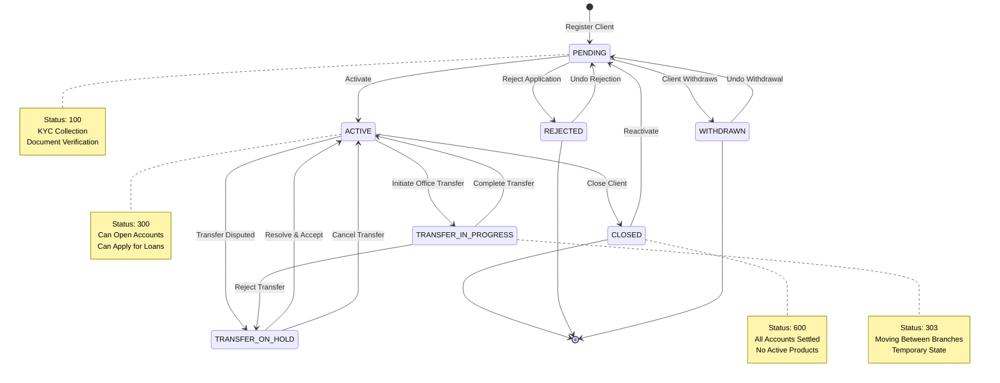
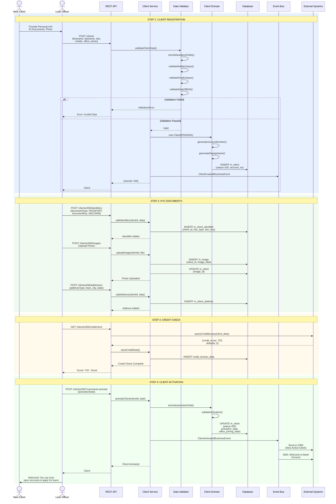
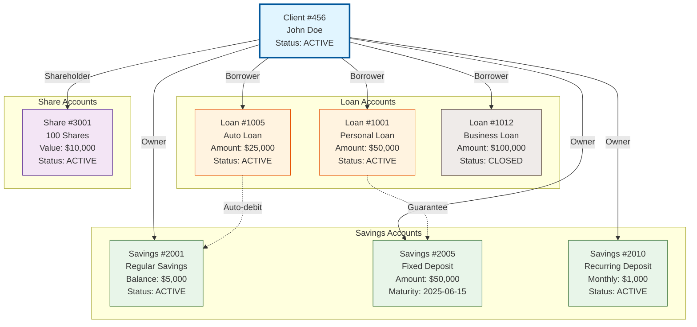
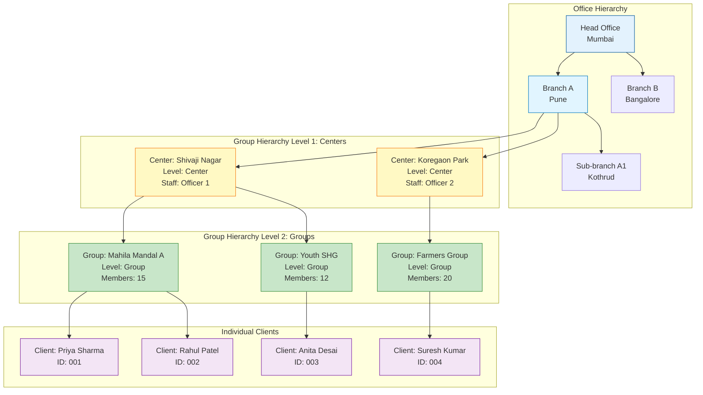
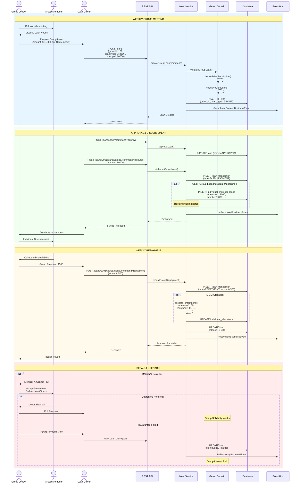
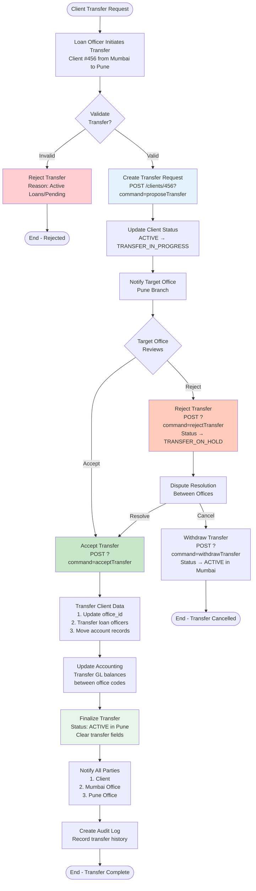
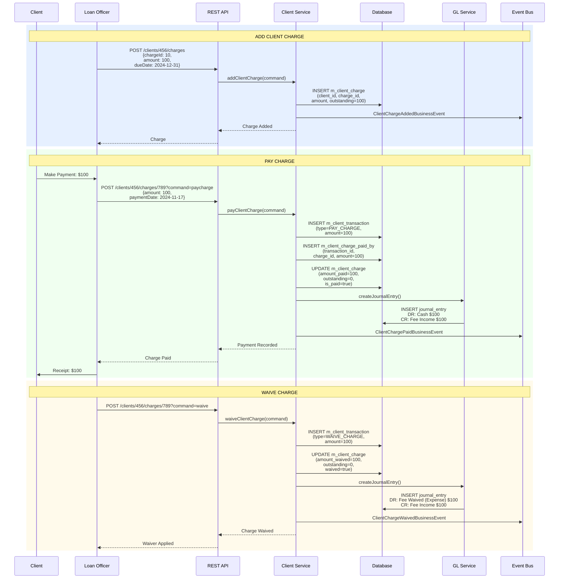

# Client & Group Management - Complete Workflow

## 1. Client Lifecycle State Diagram

## 2. Client Onboarding Workflow

## 3. Client-to-Accounts Relationship

## 4. Group Hierarchy & Structure

## 5. Group Lending Workflow

## 6. Client Transfer Between Offices

## 7. Client Charges & Transactions

## 8. Family Members & Additional Data

```mermaid
graph TB
    Client[Client: Priya Sharma<br/>ID: 456<br/>DOB: 1985-06-15]

    subgraph "Family Members"
        Spouse[Spouse: Rajesh Sharma<br/>Age: 40<br/>Occupation: Teacher<br/>Dependent: No]
        Child1[Child: Aarav Sharma<br/>Age: 12<br/>Student<br/>Dependent: Yes]
        Child2[Child: Anaya Sharma<br/>Age: 8<br/>Student<br/>Dependent: Yes]
        Mother[Mother: Sunita Patel<br/>Age: 65<br/>Retired<br/>Dependent: Yes]
    end

    subgraph "Identifiers (KYC)"
        Passport[Passport<br/>AB1234567<br/>Valid: 2030-05-20]
        Aadhaar[Aadhaar Card<br/>1234 5678 9012<br/>Status: ACTIVE]
        PAN[PAN Card<br/>ABCDE1234F<br/>Verified: Yes]
        Voter[Voter ID<br/>XYZ1234567<br/>Status: ACTIVE]
    end

    subgraph "Addresses"
        Home[Home Address<br/>Type: PERMANENT<br/>123, MG Road, Pune<br/>PIN: 411001]
        Work[Work Address<br/>Type: BUSINESS<br/>456, Tech Park, Pune<br/>PIN: 411014]
        Corr[Correspondence<br/>Type: MAILING<br/>Same as Home]
    end

    subgraph "Documents"
        Photo[Client Photo<br/>Image ID: 789<br/>Upload: 2024-01-15]
        Income[Income Certificate<br/>Annual: ₹6,00,000<br/>Employer: ABC Corp]
        Property[Property Documents<br/>Plot: 500 sq ft<br/>Value: ₹50,00,000]
    end

    Client --> Spouse
    Client --> Child1
    Client --> Child2
    Client --> Mother

    Client --> Passport
    Client --> Aadhaar
    Client --> PAN
    Client --> Voter

    Client --> Home
    Client --> Work
    Client --> Corr

    Client --> Photo
    Client --> Income
    Client --> Property

    style Client fill:#e1f5ff,stroke:#01579b,stroke-width:3px
    style Spouse fill:#c8e6c9
    style Child1 fill:#fff9c4
    style Child2 fill:#fff9c4
    style Mother fill:#ffccbc
```

## Client Status Summary

| Status | Code | Description | Allowed Actions |
|--------|------|-------------|-----------------|
| PENDING | 100 | Application submitted | Activate, Reject, Withdraw |
| ACTIVE | 300 | Fully operational | Open accounts, Apply loans, Transfer |
| TRANSFER_IN_PROGRESS | 303 | Being transferred | Accept, Reject transfer |
| TRANSFER_ON_HOLD | 304 | Transfer disputed | Resolve, Cancel |
| CLOSED | 600 | No active products | Reactivate |
| REJECTED | 700 | Application rejected | Undo rejection |
| WITHDRAWN | 800 | Client withdrew | Undo withdrawal |
