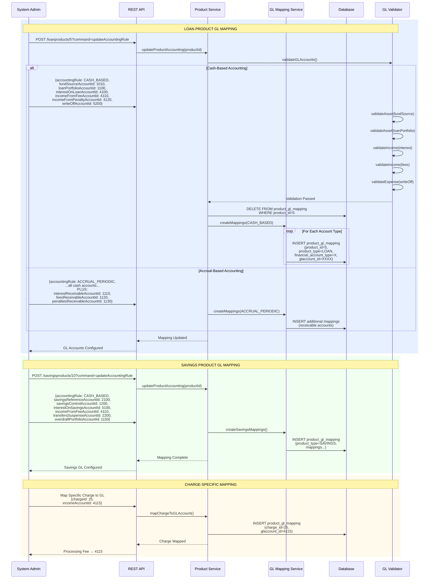
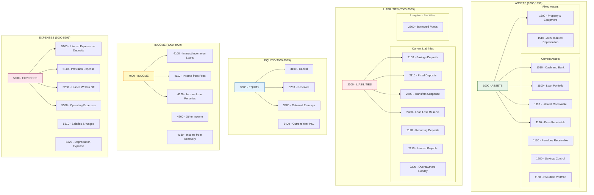
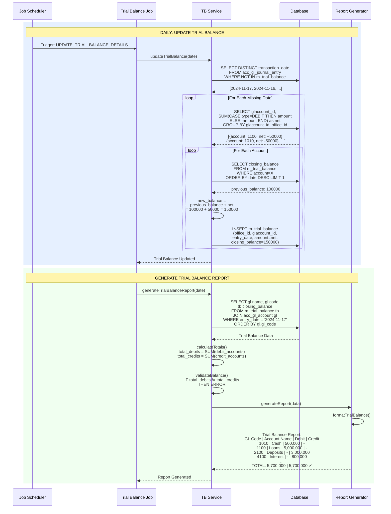
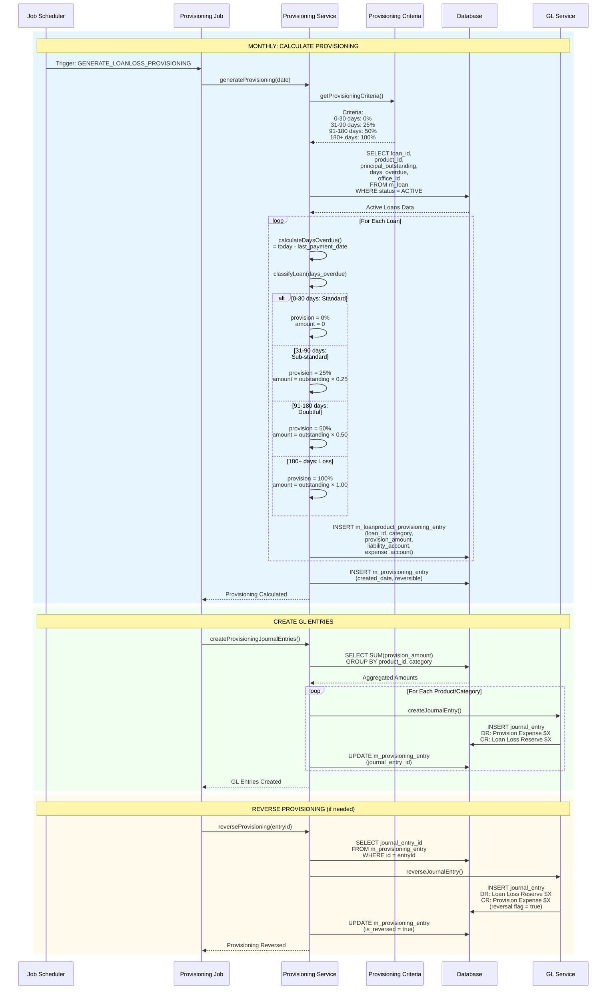
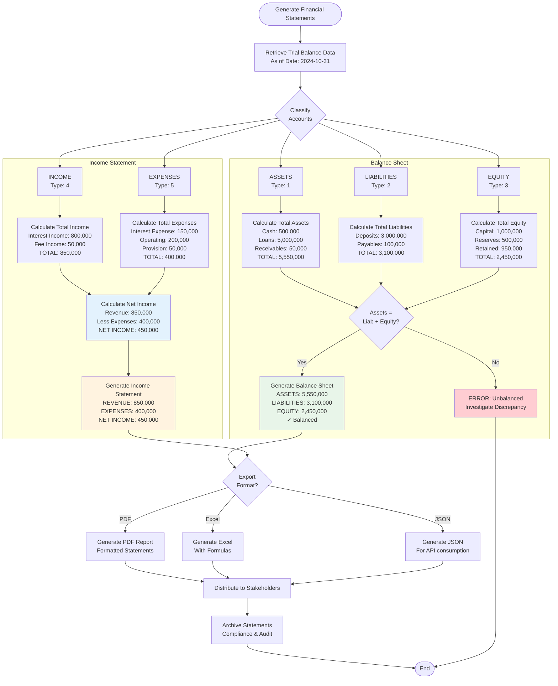

# Accounting & General Ledger Integration - Workflow

## 1. Automatic Journal Entry Generation Flow

```mermaid
flowchart TB
    Start([Banking Transaction Occurs]) --> TxnType{Transaction<br/>Type?}

    %% Loan Disbursement
    TxnType -->|Loan Disbursement| LoanDisburse[Loan Disbursement<br/>Amount: $50,000<br/>Loan #1001]

    LoanDisburse --> GetLoanMapping[Get Product-to-GL Mapping<br/>Product: Personal Loan]

    GetLoanMapping --> LoanAccounts[GL Accounts:<br/>Fund Source: 1010 (Asset)<br/>Loan Portfolio: 1100 (Asset)]

    LoanAccounts --> CreateLoanJE[Create Journal Entries:<br/>Entry 1: DR Loan Portfolio $50,000<br/>Entry 2: CR Fund Source $50,000]

    CreateLoanJE --> PostLoanJE[POST to m_journal_entry<br/>transaction_id: loan_txn_123<br/>office_id: 1]

    PostLoanJE --> UpdateTrialBal1[Update Trial Balance<br/>Loan Portfolio +$50,000<br/>Fund Source -$50,000]

    UpdateTrialBal1 --> LoanComplete([Complete])

    %% Loan Repayment
    TxnType -->|Loan Repayment| LoanRepay[Loan Repayment<br/>Total: $1,662.76<br/>Principal: $1,162.76<br/>Interest: $500.00]

    LoanRepay --> GetRepayMapping[Get GL Mappings:<br/>Loan Portfolio: 1100<br/>Interest Income: 4100<br/>Fund Source: 1010]

    GetRepayMapping --> CreateRepayJE[Create Journal Entries:<br/>DR Cash/Fund $1,662.76<br/>CR Loan Portfolio $1,162.76<br/>CR Interest Income $500.00]

    CreateRepayJE --> PostRepayJE[POST to m_journal_entry<br/>3 entries created]

    PostRepayJE --> UpdateTrialBal2[Update Trial Balance<br/>Multiple accounts]

    UpdateTrialBal2 --> RepayComplete([Complete])

    %% Savings Deposit
    TxnType -->|Savings Deposit| SavDeposit[Savings Deposit<br/>Amount: $5,000<br/>Account #2001]

    SavDeposit --> GetSavMapping[Get GL Mappings:<br/>Cash: 1010<br/>Savings Deposits: 2100 (Liability)]

    GetSavMapping --> CreateSavJE[Create Journal Entries:<br/>DR Cash $5,000<br/>CR Savings Deposits $5,000]

    CreateSavJE --> PostSavJE[POST to m_journal_entry]

    PostSavJE --> UpdateTrialBal3[Update Trial Balance]

    UpdateTrialBal3 --> SavComplete([Complete])

    %% Interest Posting
    TxnType -->|Interest Posting| IntPosting[Interest Posting<br/>Savings Interest: $100<br/>Account #2001]

    IntPosting --> GetIntMapping[Get GL Mappings:<br/>Interest Expense: 5100<br/>Savings Deposits: 2100]

    GetIntMapping --> CheckAcctMethod{Accounting<br/>Method?}

    CheckAcctMethod -->|Cash| CashInt[Create Journal Entry:<br/>DR Interest Expense $100<br/>CR Savings Deposits $100]
    CheckAcctMethod -->|Accrual| AccrualInt[Create Journal Entries:<br/>1. DR Interest Expense $100<br/>   CR Interest Payable $100<br/>2. DR Interest Payable $100<br/>   CR Savings Deposits $100]

    CashInt --> PostIntJE
    AccrualInt --> PostIntJE[POST to m_journal_entry]

    PostIntJE --> UpdateTrialBal4[Update Trial Balance]

    UpdateTrialBal4 --> IntComplete([Complete])

    %% Loan Write-off
    TxnType -->|Loan Write-off| Writeoff[Loan Write-off<br/>Outstanding: $10,000<br/>Loan #1005]

    Writeoff --> GetWOMapping[Get GL Mappings:<br/>Loan Portfolio: 1100<br/>Loss Expense: 5200]

    GetWOMapping --> CreateWOJE[Create Journal Entries:<br/>DR Loss Written Off $10,000<br/>CR Loan Portfolio $10,000]

    CreateWOJE --> PostWOJE[POST to m_journal_entry]

    PostWOJE --> UpdateProvision[Update Provisioning<br/>Increase Provision 100%]

    UpdateProvision --> CreateProvJE[Create Journal Entry:<br/>DR Provision Expense $10,000<br/>CR Loan Loss Reserve $10,000]

    CreateProvJE --> PostProvJE[POST to m_journal_entry]

    PostProvJE --> UpdateTrialBal5[Update Trial Balance]

    UpdateTrialBal5 --> WOComplete([Complete])

    style CreateLoanJE fill:#e3f2fd
    style CreateRepayJE fill:#e8f5e9
    style CreateSavJE fill:#fff3e0
    style CashInt fill:#f3e5f5
    style AccrualInt fill:#fce4ec
    style CreateWOJE fill:#ffebee
```

## 2. Product-to-GL-Account Mapping Configuration



## 3. Chart of Accounts Structure



## 4. Trial Balance Generation Process



## 5. GL Closure & Period Management

```mermaid
flowchart TD
    Start([Month/Year End]) --> InitClosure[Initiate GL Closure<br/>Close Period: 2024-10-31]

    InitClosure --> ValidateClosure{Validate<br/>Closure?}

    ValidateClosure -->|Invalid| RejectClosure[Reject Closure<br/>Reasons:<br/>- Pending transactions<br/>- Unbalanced entries<br/>- Unposted journals]

    ValidateClosure -->|Valid| CheckTrialBal[Verify Trial Balance<br/>Debits = Credits?]

    RejectClosure --> End([End - Rejected])

    CheckTrialBal -->|Unbalanced| FixEntries[Fix Unbalanced Entries<br/>Investigate discrepancies]
    CheckTrialBal -->|Balanced| GenerateReports[Generate Period Reports:<br/>1. Trial Balance<br/>2. Balance Sheet<br/>3. Income Statement<br/>4. Cash Flow]

    FixEntries --> CheckTrialBal

    GenerateReports --> ReviewReports{Review<br/>Reports}

    ReviewReports -->|Issues Found| CorrectEntries[Make Adjusting Entries<br/>Accruals, Deferrals]
    ReviewReports -->|All Good| ApproveClosure[Approve Closure]

    CorrectEntries --> CheckTrialBal

    ApproveClosure --> CreateClosure[Create GL Closure<br/>POST /glclosures<br/>{officeId, closingDate,<br/>comments}]

    CreateClosure --> InsertClosure[INSERT m_gl_closure<br/>(office_id, closing_date,<br/>comments, created_by)]

    InsertClosure --> LockPeriod[Lock Period<br/>No transactions allowed<br/>with date <= closing_date]

    LockPeriod --> TransferPL{Transfer P&L<br/>to Equity?}

    TransferPL -->|Yes| ClosePL[Close P&L Accounts<br/>DR: Income Accounts<br/>CR: Current Year P&L<br/>---<br/>DR: Current Year P&L<br/>CR: Expense Accounts]

    TransferPL -->|No| NotifyUsers

    ClosePL --> UpdateRetained[Transfer to Retained Earnings<br/>DR: Current Year P&L<br/>CR: Retained Earnings]

    UpdateRetained --> ZeroPL[Zero Out P&L Accounts<br/>Ready for new period]

    ZeroPL --> NotifyUsers[Notify Users:<br/>Period Closed<br/>New Period Open]

    NotifyUsers --> ArchiveReports[Archive Period Reports<br/>Store for audit/compliance]

    ArchiveReports --> Success([End - Closure Complete])

    style ApproveClosure fill:#e8f5e9
    style CreateClosure fill:#e3f2fd
    style LockPeriod fill:#fff3e0
    style RejectClosure fill:#ffcdd2
```

## 6. Loan Loss Provisioning Workflow



## 7. Financial Statement Generation



## GL Account Type Summary

| Type | Code | Normal Balance | Examples |
|------|------|----------------|----------|
| ASSET | 1 | Debit | Cash, Loans, Receivables |
| LIABILITY | 2 | Credit | Deposits, Payables, Reserves |
| EQUITY | 3 | Credit | Capital, Retained Earnings |
| INCOME | 4 | Credit | Interest Income, Fee Income |
| EXPENSE | 5 | Debit | Interest Expense, Operating Expenses |

## Journal Entry Rules

| Transaction | Debit | Credit |
|-------------|-------|--------|
| Loan Disbursement | Loan Portfolio (Asset) | Cash/Fund Source (Asset) |
| Loan Repayment | Cash (Asset) | Loan Portfolio (Asset) + Interest Income (Revenue) |
| Savings Deposit | Cash (Asset) | Savings Deposits (Liability) |
| Savings Withdrawal | Savings Deposits (Liability) | Cash (Asset) |
| Interest Posting (Savings) | Interest Expense (Expense) | Savings Deposits (Liability) |
| Loan Write-off | Loss Expense (Expense) | Loan Portfolio (Asset) |
| Provisioning | Provision Expense (Expense) | Loan Loss Reserve (Liability) |
