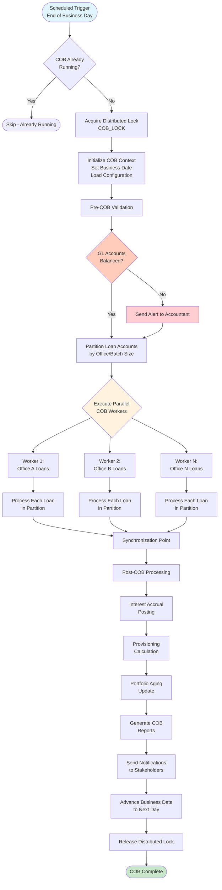
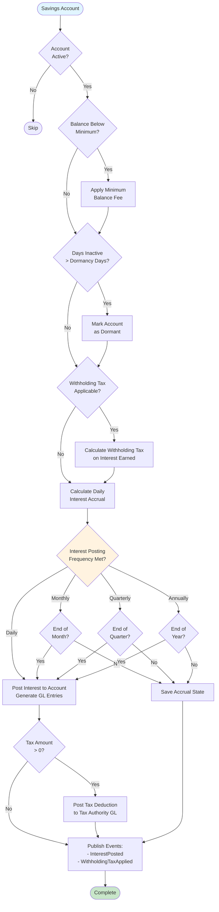
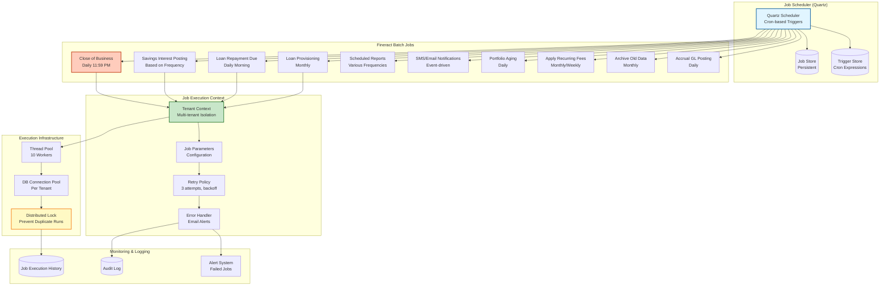
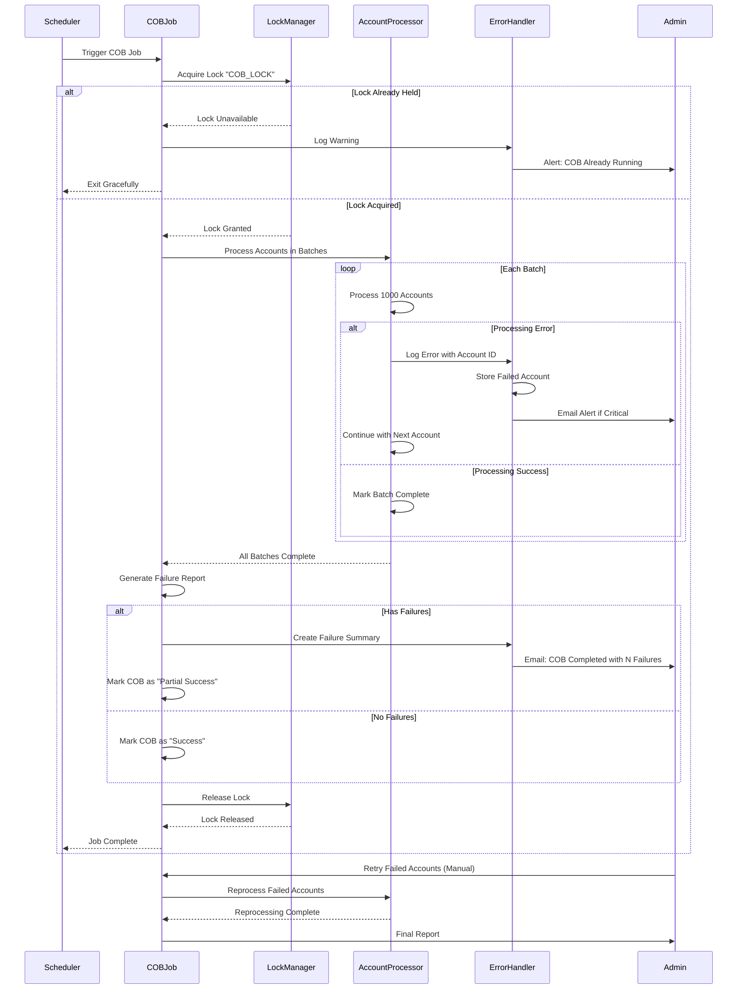
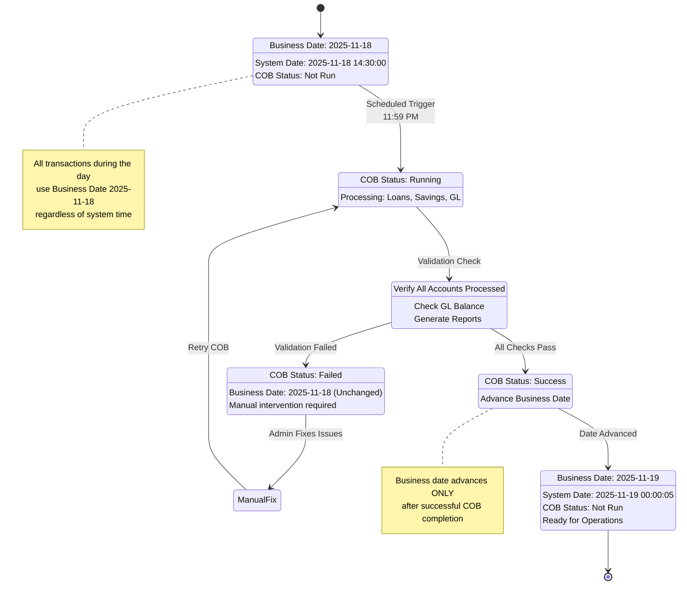
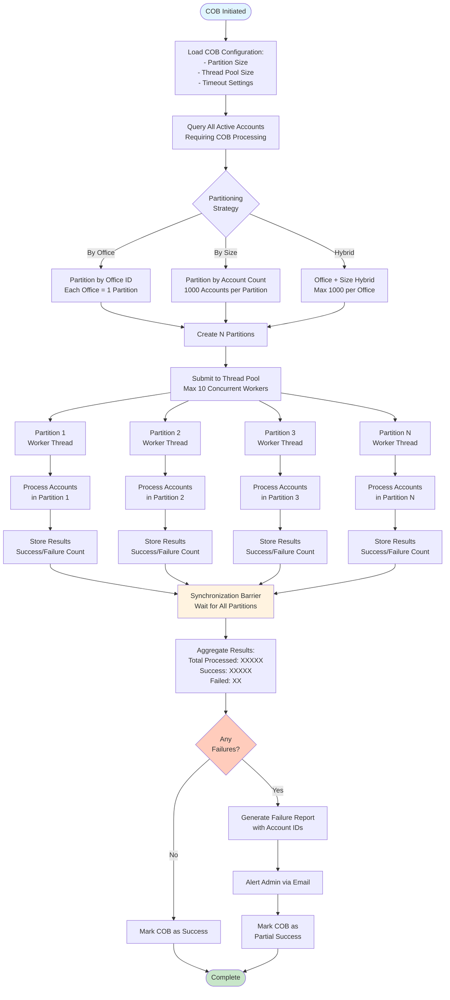

# Apache Fineract - Close of Business (COB) & Batch Processing

## 1. Close of Business (COB) Main Orchestration

## 2. Individual Loan COB Processing (Per Account)

```mermaid
flowchart LR
    Start([Loan Account]) --> LoadLoan[Load Loan<br/>with Schedule]

    LoadLoan --> CheckActive{Loan<br/>Active?}
    CheckActive -->|No| Skip([Skip])
    CheckActive -->|Yes| CheckOverdue{Has Overdue<br/>Installments?}

    CheckOverdue -->|No| AccrueInt
    CheckOverdue -->|Yes| ApplyPenalty[Apply Late Payment<br/>Penalty Charges]

    ApplyPenalty --> AccrueInt[Calculate Daily<br/>Interest Accrual]

    AccrueInt --> UpdateDerived[Update Derived Fields:<br/>- Days Overdue<br/>- Arrears Amount<br/>- Outstanding Balance]

    UpdateDerived --> ClassifyNPA{Days Overdue<br/>&gt; NPA Days?}

    ClassifyNPA -->|Yes| MarkNPA[Mark as NPA<br/>Update Classification]
    ClassifyNPA -->|No| ClassifyDelinq

    MarkNPA --> ClassifyDelinq{Delinquency<br/>Classification}

    ClassifyDelinq --> UpdateBucket[Update Delinquency Bucket<br/>0-30, 31-60, 61-90, 90+]

    UpdateBucket --> RecalcProvision[Recalculate Provisioning<br/>Based on Classification]

    RecalcProvision --> EventPublish[Publish Business Events:<br/>- LoanAccrualProcessed<br/>- LoanDelinquencyChanged<br/>- LoanNPAMarked]

    EventPublish --> SaveState[Save Updated State<br/>to Database]

    SaveState --> End([Complete])

    style Start fill:#e1f5ff
    style End fill:#c8e6c9
    style ClassifyNPA fill:#ffccbc
    style ClassifyDelinq fill:#fff3e0
```

## 3. Savings Account COB Processing

## 4. Batch Job Scheduler Architecture

## 5. COB Error Handling & Recovery

## 6. Business Date Management

## 7. Parallel COB Processing with Partitioning

## Key COB Processing Details

### COB Execution Sequence

1. **Pre-COB Phase**:
   - Acquire distributed lock to prevent concurrent COB runs
   - Validate GL accounts are balanced
   - Load configuration (partition size, parallelism level)
   - Query all active accounts requiring processing

2. **Parallel Processing Phase**:
   - Partition accounts by office or size
   - Submit partitions to thread pool (default 10 workers)
   - Each worker processes accounts independently
   - Per-account processing:
     - Load loan/savings with schedule
     - Calculate interest accrual
     - Apply penalties and fees
     - Update derived fields (days overdue, balances)
     - Classify delinquency/NPA status
     - Recalculate provisioning
     - Publish business events
   - Synchronization barrier waits for all partitions

3. **Post-COB Phase**:
   - Aggregate results from all partitions
   - Generate COB summary report
   - Post accrued interest to GL
   - Update provisioning entries
   - Refresh portfolio aging reports
   - Send notifications to stakeholders
   - Advance business date to next day
   - Release distributed lock

### Error Handling

- **Account-level errors**: Logged and reported, COB continues
- **Critical errors**: Entire COB is rolled back
- **Failed accounts**: Tracked in failure report for manual reprocessing
- **Lock timeout**: COB exits gracefully, alerts admin
- **GL imbalance**: COB is blocked until resolved

### Performance Optimizations

- **Partitioning**: Distributes load across multiple threads
- **Batch loading**: Loads accounts in batches to reduce DB queries
- **Derived fields**: Pre-calculated to avoid runtime computation
- **Event batching**: Business events are batched before publishing
- **Index usage**: Queries optimized with indexes on account status, office ID

### Business Date Management

- Business date is independent of system date
- Transactions always use current business date
- Business date advances ONLY after successful COB
- Failed COB keeps business date unchanged
- Manual date override available for admins (holidays, system downtime)

### Monitoring & Alerts

- **Job execution history**: Stored for auditing
- **Performance metrics**: Average processing time per account
- **Failure rate**: Percentage of failed accounts
- **Email alerts**: Sent for failures, partial success, or critical errors
- **Dashboard**: Real-time COB progress tracking
