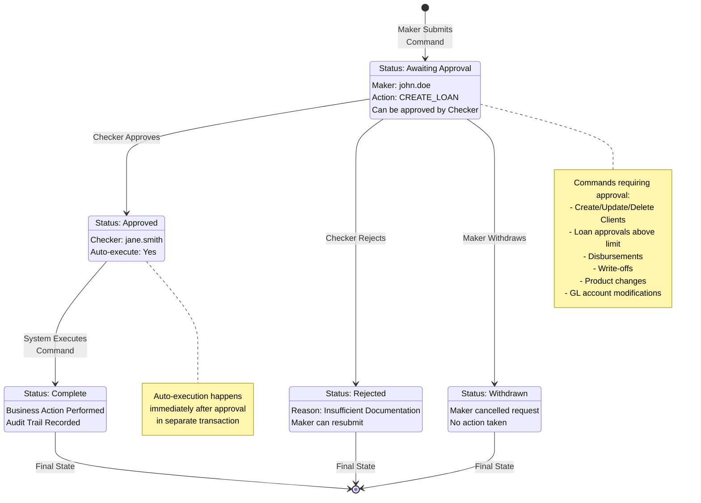
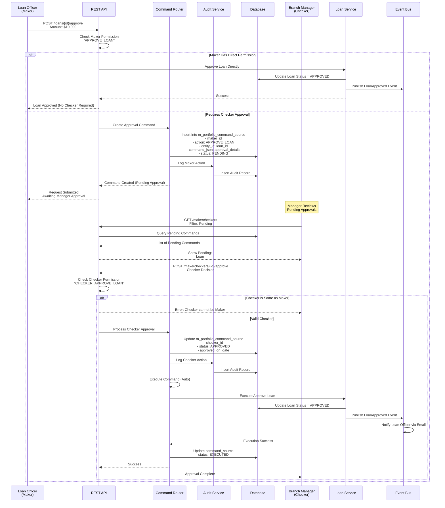
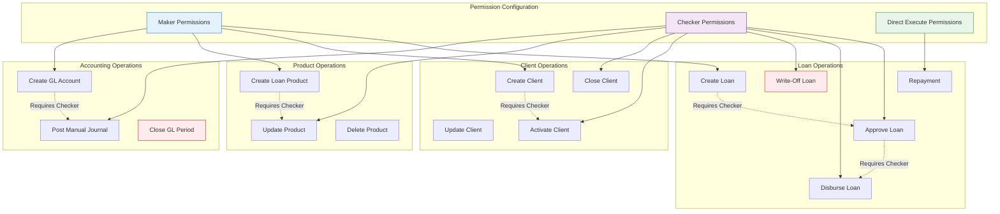
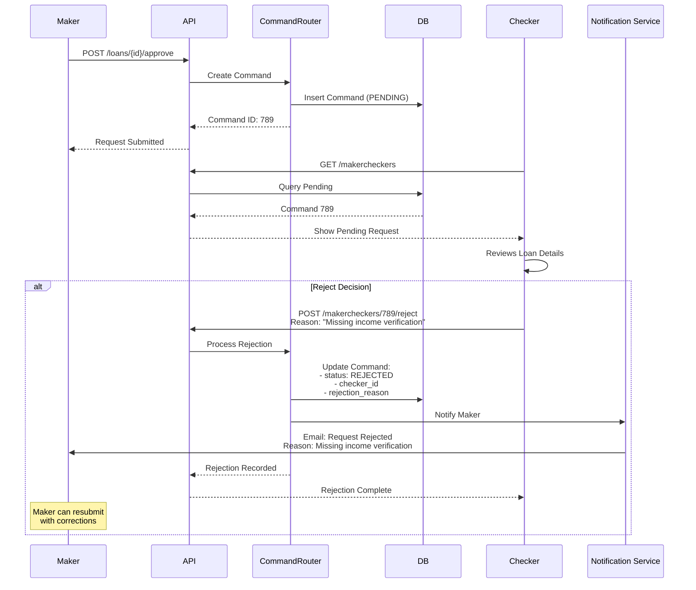
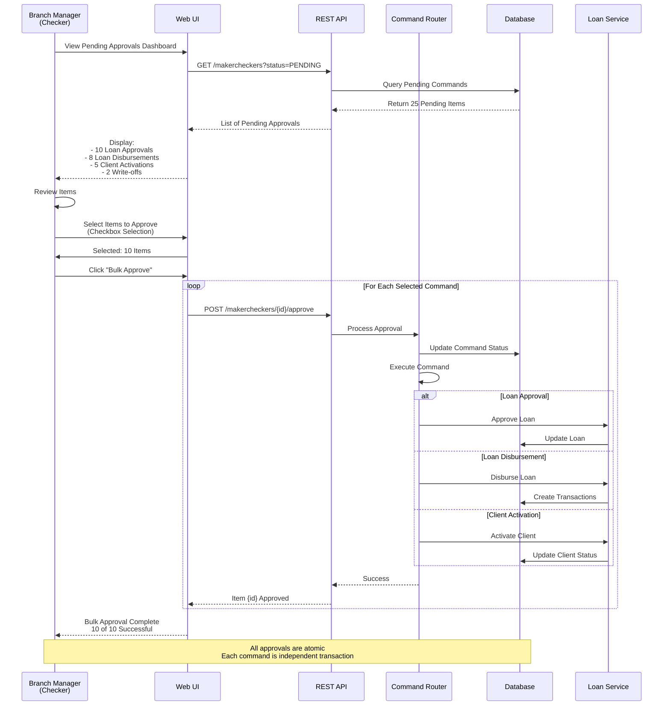
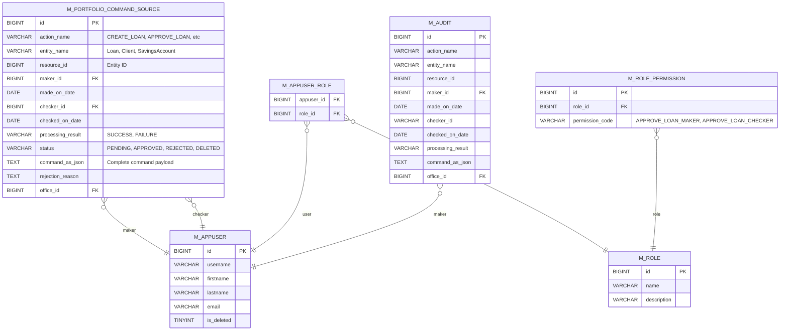

# Apache Fineract - Maker-Checker Approval Workflow

## 1. Maker-Checker State Machine



## 2. Loan Approval Sequence (Maker-Checker)



## 3. Maker-Checker Configuration Matrix



## 4. Rejection Workflow



## 5. Maker Withdrawal Workflow

```mermaid
flowchart LR
    Start([Maker Submits Command]) --> Pending[Command Status:<br/>PENDING]

    Pending --> MakerReview{Maker Realizes<br/>Mistake?}

    MakerReview -->|No| WaitChecker[Wait for Checker]
    MakerReview -->|Yes| Withdraw

    Withdraw[Maker Withdraws Request] --> CheckStatus{Already<br/>Approved?}

    CheckStatus -->|Yes| CannotDelete[Error: Cannot Delete<br/>Already Approved]
    CheckStatus -->|No| DeleteCmd[DELETE /makercheckers/{id}]

    DeleteCmd --> UpdateDB[Update DB:<br/>status = DELETED]
    UpdateDB --> AuditLog[Log Withdrawal<br/>in Audit Trail]
    AuditLog --> NotifyChecker[Notify Checker:<br/>Request Withdrawn]
    NotifyChecker --> End([Command Deleted])

    WaitChecker --> CheckerAction{Checker<br/>Action}
    CheckerAction -->|Approve| Approved
    CheckerAction -->|Reject| Rejected

    Approved[Status: APPROVED] --> Execute[Auto-Execute]
    Execute --> Complete([Complete])

    Rejected[Status: REJECTED] --> Final([Final])

    CannotDelete --> ErrorEnd([Error])

    style Start fill:#e1f5ff
    style End fill:#c8e6c9
    style Complete fill:#c8e6c9
    style Final fill:#ffccbc
    style ErrorEnd fill:#ffcdd2
```

## 6. Bulk Approval Workflow



## 7. Maker-Checker Database Schema



## 8. Permission-Based Routing

```mermaid
flowchart TB
    Start([User Action:<br/>POST /loans/{id}/approve]) --> ExtractUser[Extract User from<br/>Security Context]

    ExtractUser --> LoadPerms[Load User Permissions<br/>from Roles]

    LoadPerms --> CheckDirect{Has Direct<br/>Permission?<br/>APPROVE_LOAN}

    CheckDirect -->|Yes| DirectExec[Execute Directly<br/>No Maker-Checker]

    CheckDirect -->|No| CheckMaker{Has Maker<br/>Permission?<br/>APPROVE_LOAN_MAKER}

    CheckMaker -->|Yes| CreateCommand[Create Pending Command<br/>Route to Checker Queue]

    CheckMaker -->|No| Unauthorized[HTTP 403<br/>Unauthorized]

    CreateCommand --> NotifyChecker[Notify Checker via:<br/>- Email<br/>- Dashboard Alert<br/>- Mobile Push]

    NotifyChecker --> WaitApproval[Wait for Checker<br/>Approval]

    WaitApproval --> CheckerReview{Checker<br/>Reviews}

    CheckerReview -->|Approve| CheckSameUser{Checker ==<br/>Maker?}
    CheckerReview -->|Reject| Rejected[Mark REJECTED<br/>Notify Maker]

    CheckSameUser -->|Yes| ErrorSelf[Error: Self-Approval<br/>Not Allowed]
    CheckSameUser -->|No| AutoExec[Auto-Execute Command]

    AutoExec --> Success[Command Executed<br/>Business Action Complete]

    DirectExec --> Success
    Rejected --> End([End])
    ErrorSelf --> End
    Unauthorized --> End
    Success --> End

    style Start fill:#e1f5ff
    style Success fill:#c8e6c9
    style Unauthorized fill:#ffcdd2
    style ErrorSelf fill:#ffcdd2
    style Rejected fill:#ffccbc
```

## Key Maker-Checker Concepts

### Permission Model

Fineract uses a dual permission model for maker-checker operations:

1. **Direct Execute Permission**: User can execute action immediately without approval
   - Example: `APPROVE_LOAN`
   - Typically for senior staff or automated processes

2. **Maker Permission**: User can initiate action, requires checker approval
   - Example: `APPROVE_LOAN_MAKER`
   - Typically for loan officers, junior staff

3. **Checker Permission**: User can approve actions initiated by makers
   - Example: `APPROVE_LOAN_CHECKER`
   - Typically for managers, senior staff

### Approval Rules

- **Self-approval prevention**: A user cannot approve their own request
- **Office-level scoping**: Checkers can only approve requests from their office hierarchy
- **Role-based**: Both maker and checker must have appropriate role permissions
- **Audit trail**: All maker-checker actions are logged in `m_audit` table

### Command Storage

All pending maker-checker commands are stored in `m_portfolio_command_source` table:
- **command_as_json**: Complete JSON payload of the original request
- **action_name**: Type of action (CREATE_LOAN, APPROVE_LOAN, DISBURSE_LOAN, etc.)
- **entity_name**: Entity type (Loan, Client, SavingsAccount, etc.)
- **resource_id**: ID of the specific entity
- **maker_id**: User who created the request
- **checker_id**: User who approved/rejected (NULL if pending)
- **status**: PENDING, APPROVED, REJECTED, DELETED

### Auto-Execution

After checker approval, commands are automatically executed:
1. Command status updated to APPROVED
2. Original command JSON is deserialized
3. Business service method is invoked
4. Database transaction is committed
5. Events are published
6. Command status updated to EXECUTED

### Use Cases Requiring Maker-Checker

**High-risk operations**:
- Loan write-offs
- Large disbursements (above threshold)
- Client data modifications
- Product configuration changes
- GL account modifications
- Manual journal entries

**Configurable by permission**:
- Organization can decide which operations require maker-checker
- Permissions are assigned to roles
- Users get permissions through role assignments

### Rejection Workflow

When checker rejects:
1. Command status → REJECTED
2. Rejection reason stored
3. Maker notified via email
4. Original request remains in history (audit trail)
5. Maker can submit new request with corrections

### Dashboard & Reporting

- **Maker Dashboard**: Shows status of submitted requests
- **Checker Dashboard**: Shows pending approvals by office
- **Audit Reports**: Complete history of maker-checker actions
- **Aging Reports**: How long requests have been pending
- **Performance Metrics**: Approval rates, average approval time
