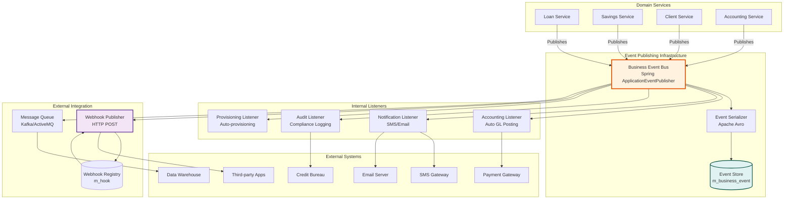
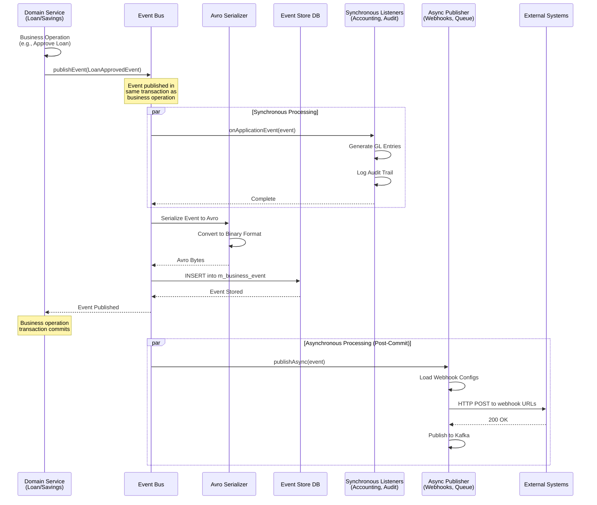
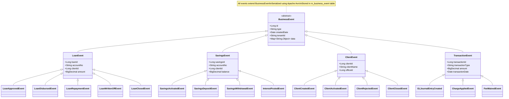
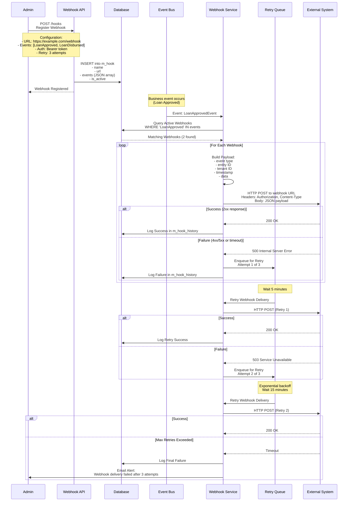
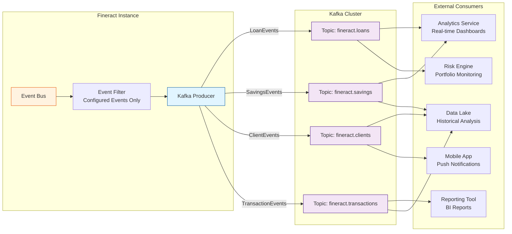
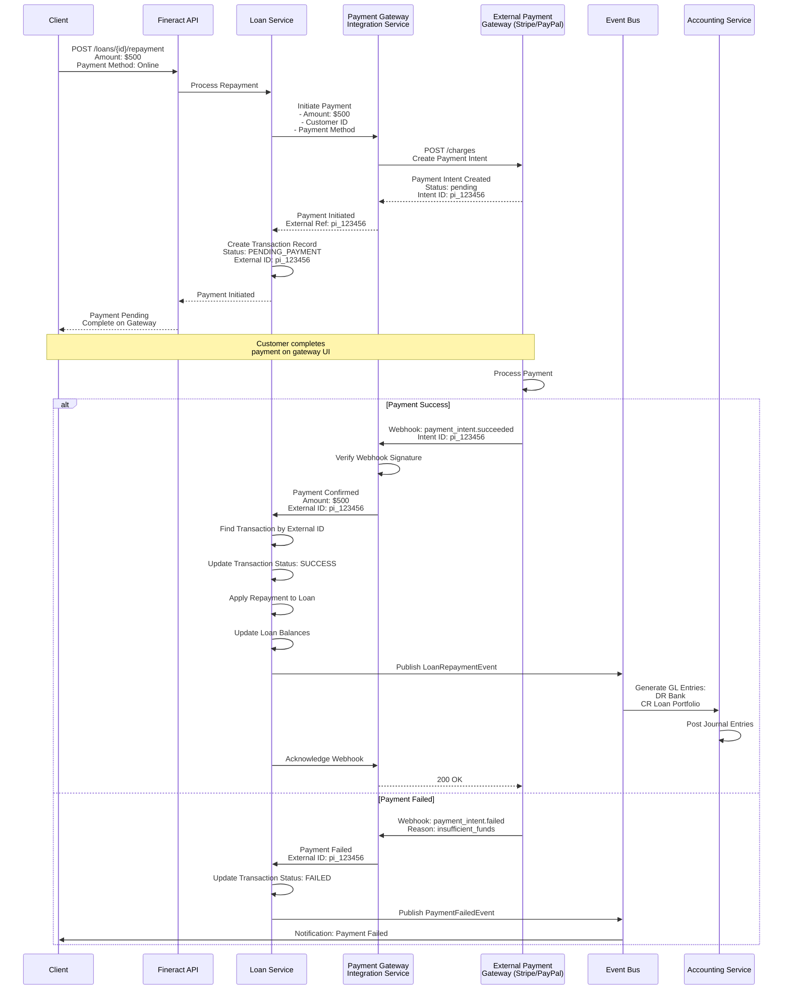
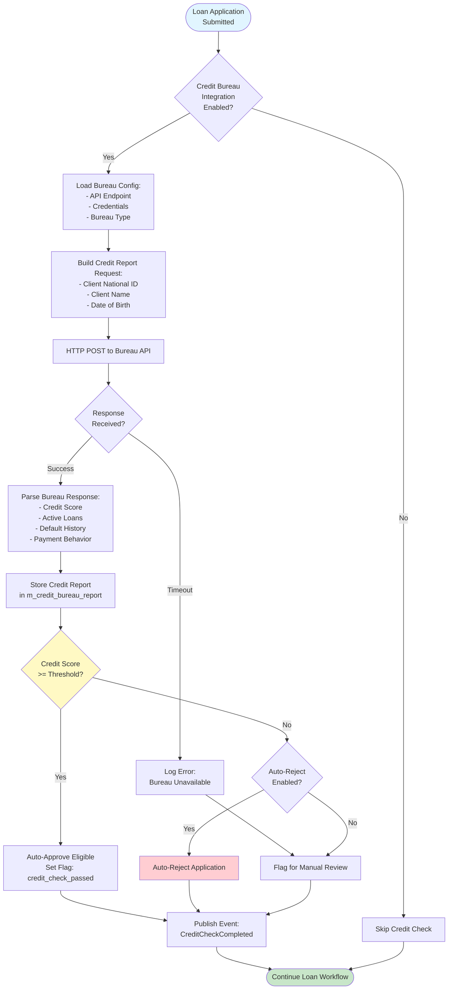
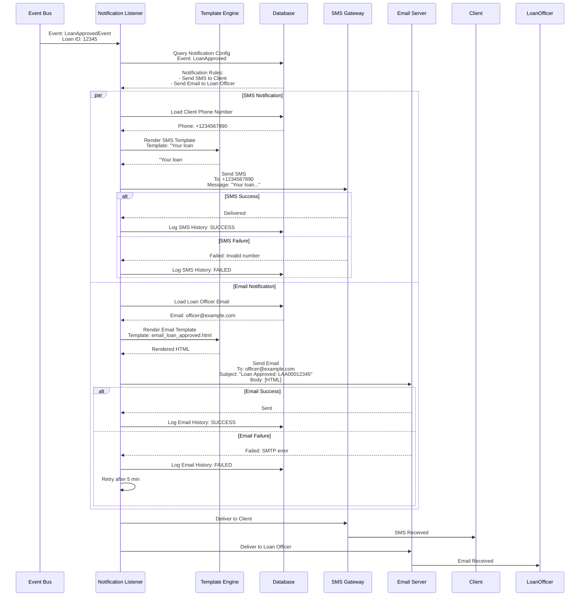
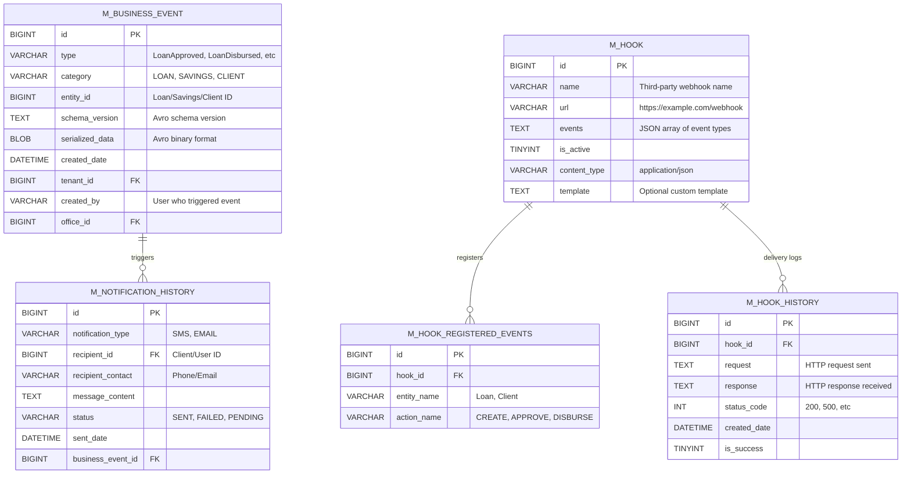
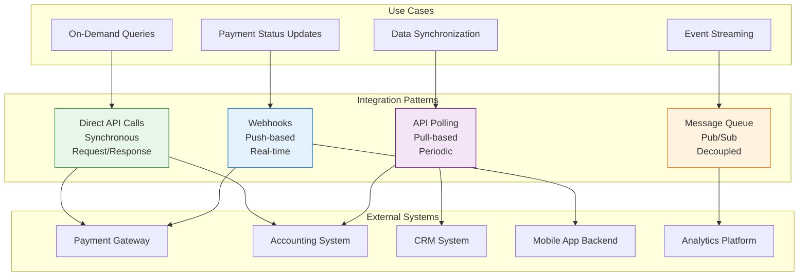

# Apache Fineract - Integration & Event-Driven Architecture

## 1. Event Bus Architecture

## 2. Event Publishing Flow

## 3. Event Types & Schema

## 4. Webhook Configuration & Delivery

## 5. Message Queue Integration (Kafka)

## 6. Payment Gateway Integration

## 7. Credit Bureau Integration

## 8. SMS & Email Notification Flow

## 9. Event Store & Audit Trail

## 10. External API Integration Patterns

## Key Integration Concepts

### Event-Driven Architecture

Fineract implements event-driven architecture using:
- **Spring ApplicationEventPublisher**: For internal event bus
- **Apache Avro**: For event serialization (schema evolution support)
- **Synchronous listeners**: Execute in same transaction (accounting, audit)
- **Asynchronous publishers**: Execute post-commit (webhooks, message queue)

### Event Types

Over 100 business events across domains:
- **Loan events**: Application, approval, disbursement, repayment, write-off, closure
- **Savings events**: Activation, deposit, withdrawal, interest posting
- **Client events**: Creation, activation, rejection, transfer, closure
- **Transaction events**: Journal entries, fee application, charge waiver
- **System events**: COB completion, batch job execution

### Webhook Delivery

- **Configuration**: Webhooks registered with URL, events, auth headers
- **Retry logic**: 3 attempts with exponential backoff (5min, 15min, 45min)
- **Delivery history**: All webhook deliveries logged with response status
- **Security**: Support for Bearer token, API key, Basic auth
- **Payload**: JSON format with event type, tenant ID, entity ID, timestamp, data

### Message Queue Integration

- **Kafka topics**: Separate topics per domain (loans, savings, clients)
- **Event filter**: Only configured events are published to queue
- **Consumer groups**: Multiple consumers can process same events
- **Ordering**: Events for same entity maintain order within partition
- **Retention**: Configurable retention period (default 7 days)

### Payment Gateway Integration

- **Supported gateways**: Stripe, PayPal, Razorpay, custom implementations
- **Payment flow**:
  1. Fineract initiates payment intent
  2. Customer completes payment on gateway
  3. Gateway sends webhook on completion
  4. Fineract processes webhook, updates transaction
  5. Accounting entries generated automatically
- **Reconciliation**: Scheduled job matches gateway transactions with Fineract records

### Credit Bureau Integration

- **Supported bureaus**: Equifax, Experian, TransUnion, local bureaus
- **Credit check triggers**: Loan application, client activation
- **Data retrieved**: Credit score, active loans, default history, payment behavior
- **Auto-decisioning**: Configure score thresholds for auto-approval/rejection
- **Compliance**: Stores client consent before pulling credit report

### Notification Channels

- **SMS**: Integration with Twilio, AWS SNS, local SMS gateways
- **Email**: SMTP server configuration for transactional emails
- **Push notifications**: Mobile app integration via Firebase Cloud Messaging
- **Templates**: Configurable templates with placeholders
- **Delivery tracking**: All notifications logged with delivery status
