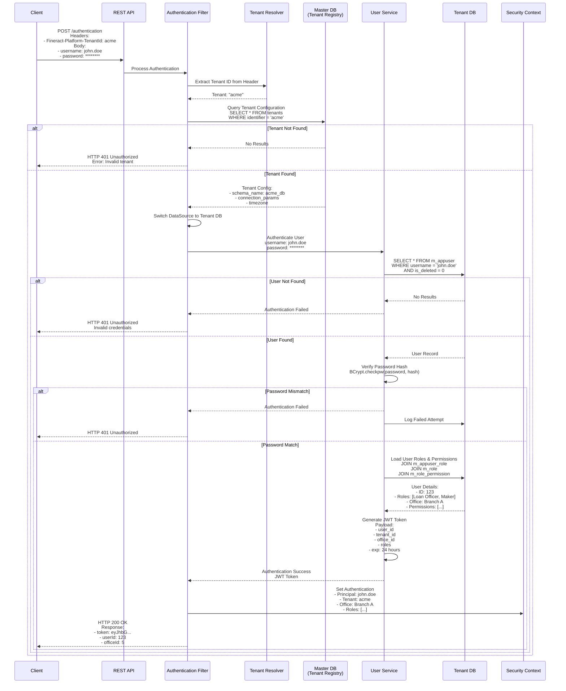
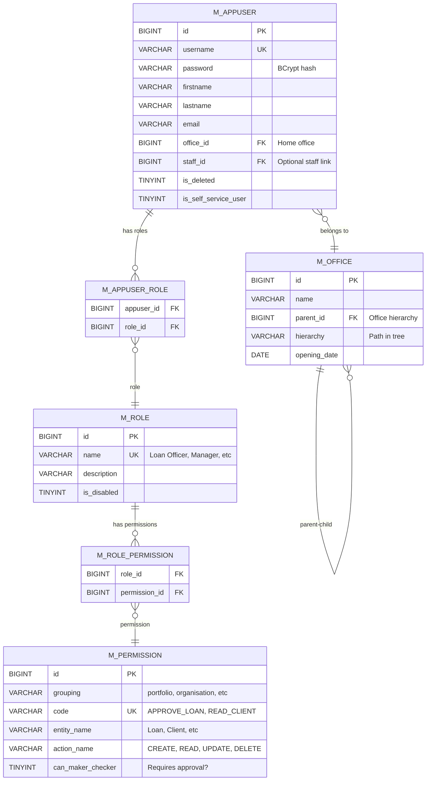
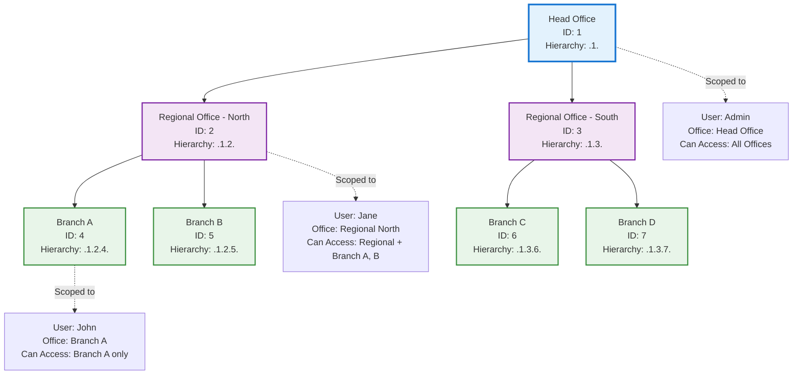
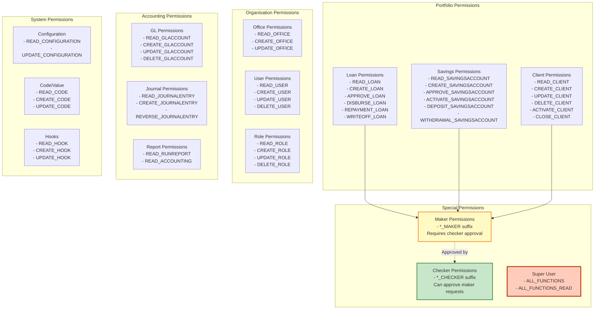
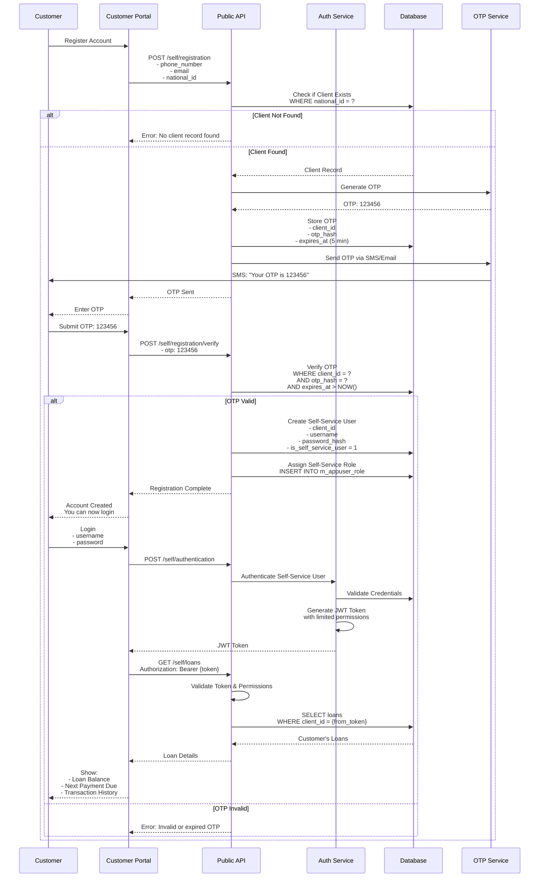
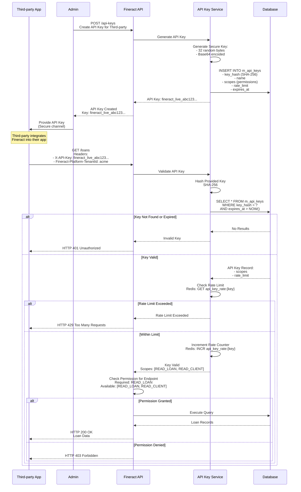
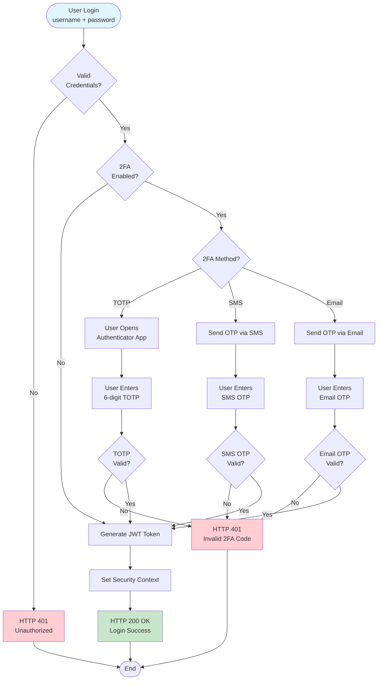

# Apache Fineract - Security & Authorization Architecture

## 1. Authentication Flow (Multi-Tenant)



## 2. Authorization Flow (RBAC + Data Scoping)

```mermaid
flowchart TB
    Start([API Request:<br/>POST /loans/{id}/approve]) --> ExtractToken[Extract JWT Token<br/>from Authorization Header]

    ExtractToken --> ValidateToken{Valid JWT?}

    ValidateToken -->|No| Unauthorized[HTTP 401<br/>Unauthorized]
    ValidateToken -->|Yes| ParseToken[Parse Token Claims:<br/>- user_id<br/>- tenant_id<br/>- office_id<br/>- roles]

    ParseToken --> LoadPerms[Load User Permissions<br/>from Database]

    LoadPerms --> CheckPermission{Has Permission:<br/>APPROVE_LOAN?}

    CheckPermission -->|No| Forbidden[HTTP 403<br/>Forbidden]
    CheckPermission -->|Yes| LoadResource[Load Loan Record<br/>from Database]

    LoadResource --> CheckOffice{Loan Office<br/>in User's<br/>Office Hierarchy?}

    CheckOffice -->|No| ForbiddenOffice[HTTP 403<br/>Out of Office Scope]
    CheckOffice -->|Yes| CheckStatus{Loan Status<br/>Allows Approval?}

    CheckStatus -->|No| BadRequest[HTTP 400<br/>Invalid State]
    CheckStatus -->|Yes| Execute[Execute Business Logic:<br/>Approve Loan]

    Execute --> Success[HTTP 200 OK<br/>Loan Approved]

    Unauthorized --> End([End])
    Forbidden --> End
    ForbiddenOffice --> End
    BadRequest --> End
    Success --> End

    style Start fill:#e1f5ff
    style Success fill:#c8e6c9
    style Unauthorized fill:#ffcdd2
    style Forbidden fill:#ffcdd2
    style ForbiddenOffice fill:#ffcdd2
    style BadRequest fill:#fff9c4
```

## 3. Role-Based Access Control (RBAC) Model



## 4. Office Hierarchy & Data Scoping



## 5. Permission Grouping & Hierarchy



## 6. Self-Service User Flow (Mobile/Web Portal)



## 7. API Key Authentication (Third-Party Integration)



## 8. Two-Factor Authentication (2FA) Flow



## 9. Security Configuration & Hardening

```mermaid
graph TB
    subgraph "Password Security"
        PasswordPolicy[Password Policy<br/>- Min length: 12<br/>- Complexity: Upper+Lower+Number+Special<br/>- History: Last 5 passwords<br/>- Expiry: 90 days]

        PasswordHashing[Password Hashing<br/>- Algorithm: BCrypt<br/>- Work factor: 12<br/>- Salt: Per-password]

        AccountLockout[Account Lockout<br/>- Failed attempts: 5<br/>- Lockout duration: 30 min<br/>- Admin unlock required]
    end

    subgraph "Session Security"
        JWTConfig[JWT Configuration<br/>- Algorithm: RS256<br/>- Expiry: 24 hours<br/>- Refresh: 7 days<br/>- Revocation: Blacklist]

        SessionTimeout[Session Timeout<br/>- Idle timeout: 30 min<br/>- Absolute timeout: 8 hours<br/>- Extend on activity]

        ConcurrentSession[Concurrent Sessions<br/>- Max sessions: 1<br/>- Kill oldest on new login]
    end

    subgraph "Network Security"
        HTTPS[HTTPS Enforcement<br/>- TLS 1.2+<br/>- Strong cipher suites<br/>- HSTS enabled]

        RateLimit[Rate Limiting<br/>- Login: 5 attempts/min<br/>- API: 100 requests/min<br/>- By IP + User]

        CORS[CORS Policy<br/>- Allowed origins<br/>- Allowed methods<br/>- Credentials: true]

        IPWhitelist[IP Whitelist<br/>- Admin IPs<br/>- API Key IPs<br/>- Office network ranges]
    end

    subgraph "Data Security"
        Encryption[Encryption at Rest<br/>- Database: AES-256<br/>- Backups: Encrypted<br/>- Logs: Sensitive data masked]

        DataMasking[Data Masking<br/>- API responses<br/>- Logs<br/>- Audit trails]

        PII[PII Protection<br/>- GDPR compliance<br/>- Data retention policies<br/>- Right to deletion]
    end

    subgraph "Audit & Monitoring"
        AuditLog[Audit Logging<br/>- All API calls<br/>- Authentication events<br/>- Data changes<br/>- Permission changes]

        AlertSystem[Alert System<br/>- Failed logins<br/>- Permission violations<br/>- Suspicious activity<br/>- Data exports]

        IntrusionDetect[Intrusion Detection<br/>- SQL injection<br/>- XSS attempts<br/>- CSRF tokens<br/>- Anomaly detection]
    end

    PasswordPolicy --> PasswordHashing
    PasswordHashing --> AccountLockout

    JWTConfig --> SessionTimeout
    SessionTimeout --> ConcurrentSession

    HTTPS --> RateLimit
    RateLimit --> CORS
    CORS --> IPWhitelist

    Encryption --> DataMasking
    DataMasking --> PII

    AuditLog --> AlertSystem
    AlertSystem --> IntrusionDetect

    style HTTPS fill:#c8e6c9,stroke:#2e7d32,stroke-width:2px
    style Encryption fill:#c8e6c9,stroke:#2e7d32,stroke-width:2px
    style AuditLog fill:#fff9c4,stroke:#f57f17,stroke-width:2px
```



## Key Security Features

### Multi-Tenant Security Isolation

- **Database-per-tenant**: Each tenant has separate database schema
- **Tenant resolution**: Extracted from HTTP header `Fineract-Platform-TenantId`
- **Connection pooling**: Separate connection pools per tenant
- **Data isolation**: No cross-tenant data access possible
- **Schema validation**: Tenant must exist in master DB before access

### Authentication Methods

1. **Basic Authentication**: Username + Password (primary)
2. **OAuth2**: Support for external identity providers
3. **API Keys**: For third-party integrations
4. **Self-Service**: Customer portal with OTP verification
5. **Two-Factor Authentication**: TOTP, SMS, Email OTP

### Authorization Model

- **RBAC**: Role-based access control with granular permissions
- **Office hierarchy**: Users can only access data within their office tree
- **Permission groups**: Organized by domain (portfolio, organisation, accounting, system)
- **Maker-Checker**: Dual control for sensitive operations
- **Self-service scoping**: Customers can only see their own data

### Password Security

- **Hashing**: BCrypt with work factor 12
- **Salting**: Unique salt per password
- **Complexity**: Configurable password policy
- **History**: Prevents password reuse
- **Expiry**: Force periodic password changes
- **Account lockout**: After failed login attempts

### Session Management

- **JWT tokens**: Stateless authentication
- **Token expiry**: 24 hours (configurable)
- **Refresh tokens**: 7 days (configurable)
- **Token revocation**: Blacklist for immediate logout
- **Concurrent sessions**: Limit active sessions per user

### API Security

- **HTTPS only**: All API traffic encrypted
- **CORS**: Configurable cross-origin policy
- **Rate limiting**: Prevent abuse and DoS
- **Input validation**: Prevent injection attacks
- **Output encoding**: Prevent XSS
- **CSRF protection**: Token-based for state-changing operations

### Audit & Compliance

- **Audit trail**: All API calls logged with user, timestamp, changes
- **Change tracking**: Before/after values for data modifications
- **Login tracking**: Successful and failed login attempts
- **Permission tracking**: Changes to roles and permissions
- **Data export tracking**: Log all data exports for compliance
- **Retention**: Configurable audit log retention period

### Data Protection

- **Encryption at rest**: Database encryption (TDE)
- **Encryption in transit**: TLS 1.2+
- **PII masking**: Sensitive data masked in logs
- **GDPR compliance**: Support for data subject rights
- **Data retention**: Configurable retention policies
- **Backup security**: Encrypted backups with access controls
